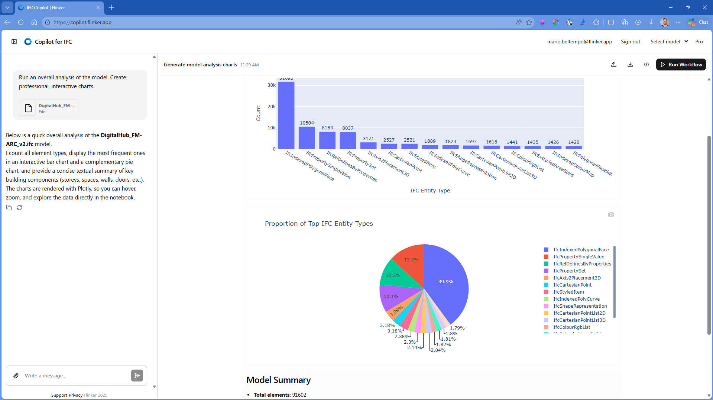
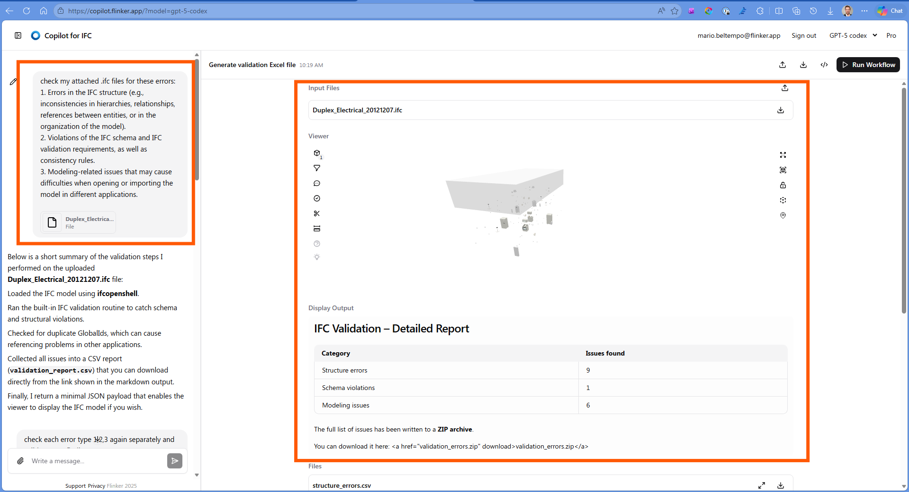
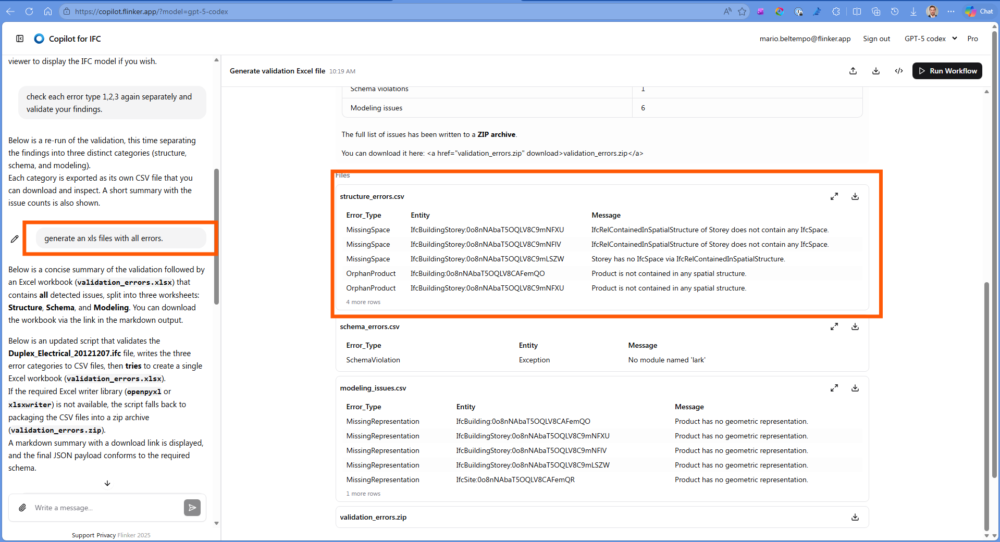
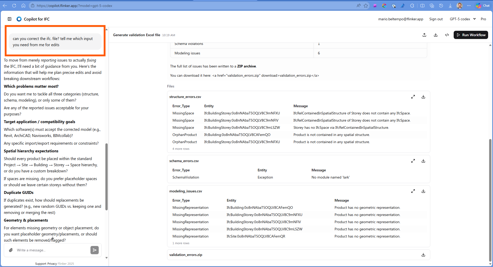
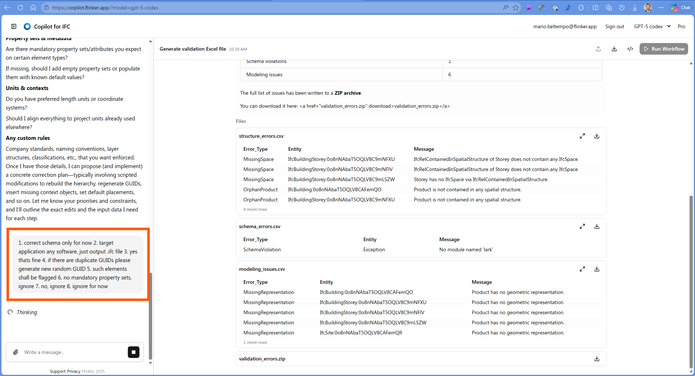
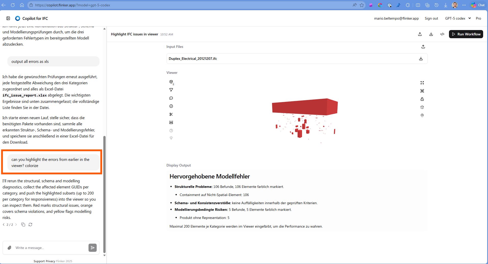
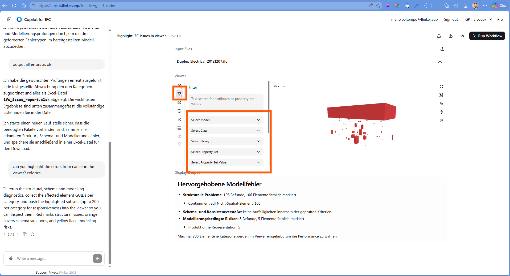
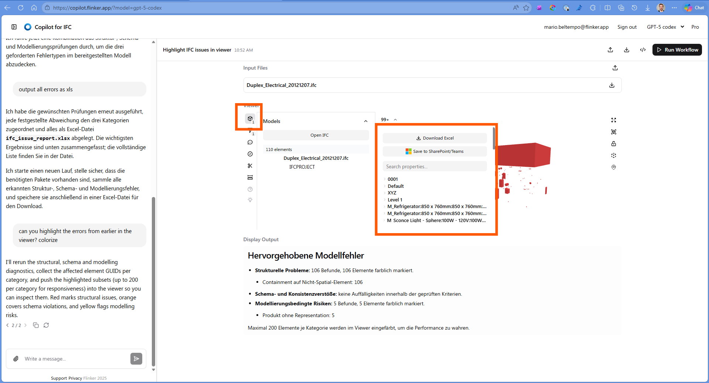
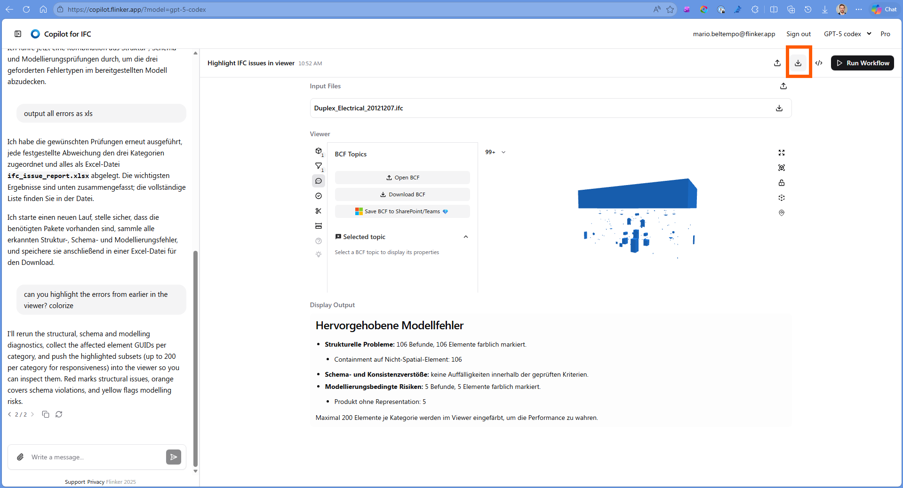
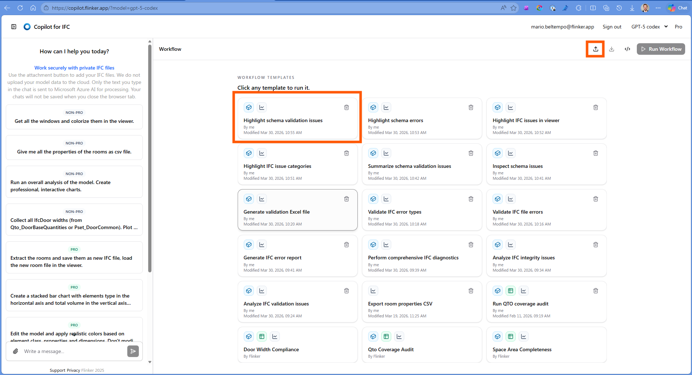

## The IFC Quality Problem Every BIM Team Knows

IFC files are the primary exchange format across the AECO industry — but a file that opens correctly in one tool regularly carries issues that cause silent failures when used downstream. Structural hierarchy problems, schema violations, and missing representations often go undetected until another application fails to import the model, a coordination platform flags unexpected gaps, or a handover package is rejected at quality review.

The underlying problem is not authoring quality alone. It is the absence of a fast, structured way to check what is wrong, understand the scope of each issue class, and act on it — either by exporting findings for the team to work with or by correcting the file with full traceability of what was changed and why.

Copilot for IFC closes this gap. It runs structured diagnostics against any IFC file, returns categorized findings, lets teams visualize affected elements in context, guides corrections through explicit qualification steps, and exports outputs directly into Microsoft 365 collaboration workflows.

> **Use free** — Upload any IFC file at [copilot.flinker.app](https://copilot.flinker.app/) and run your first diagnostics in minutes.

*Diagnose IFC quality issues, inspect them visually, apply guided corrections, and push findings into team workflows.*

## What Is Evaluated in This Workflow

The validation run separates findings into three technical categories that matter for interoperability and downstream use:

- **IFC structure errors**: hierarchy, containment, and relationship issues such as missing spaces or orphan products.
- **Schema and consistency violations**: IFC schema checks and rule-level exceptions that indicate invalid or incomplete processing conditions.
- **Modeling-risk issues**: modeling problems (for example, missing representations) that can break import or cause unreliable behavior across tools.

In the example run shown below, these categories are reported separately so teams can triage and assign actions faster.

## Step-by-Step Demo Flow

### 1. Load the IFC and ask Copilot for a full diagnostic

The evaluator uploads a sample IFC and asks Copilot for structure, schema, and modeling checks in one run.

*Start with a plain-language validation prompt against the uploaded IFC file.*

### 2. Review categorized findings and issue counts

Copilot returns a structured report with category counts and downloadable outputs.

*Findings are grouped by category to support fast triage and ownership assignment.*

### 3. Export findings as working files

The evaluator can copy summaries directly in chat and request file exports (for example CSV/XLS) for technical review.

*Exportable outputs make review and documentation easier across BIM and non-BIM roles.*

### 4. Move from diagnosis to controlled correction

When teams want to edit IFC content, Copilot can switch from reporting to guided correction mode.

*Correction actions are initiated with explicit user intent rather than hidden auto-changes.*

### 5. Provide qualification answers before edits are applied

Before writing an updated IFC, Copilot asks qualification questions so edit behavior matches project intent and downstream software needs.

Here is an example of what Copilot asks before applying any edits:

> *To move from merely reporting issues to actually fixing the IFC, I'll need a bit of guidance from you. Here's the information that will help me plan precise edits and avoid breaking downstream workflows:*
>
> 1. **Which problems matter most?** — All three categories, or only selected ones? Are any reported issues acceptable for your purposes?
> 2. **Target application / compatibility goals** — Which software must accept the corrected model (e.g., Revit, ArchiCAD, Navisworks, BIMcollab)? Any specific import/export constraints?
> 3. **Spatial hierarchy expectations** — Standard Project → Site → Building → Storey → Space hierarchy, or a custom breakdown? Placeholder spaces if missing, or leave certain storeys without them?
> 4. **Duplicate GUIDs** — New random GUIDs, keep one and remove duplicates, or merge?
> 5. **Geometry and placements** — Add placeholder geometry for elements missing it, or remove/flag those elements?
> 6. **Property sets and metadata** — Any mandatory property sets expected on certain element types? Add empty sets or populate with known defaults if missing?
> 7. **Units and coordinate systems** — Preferred length units? Align to project units already used elsewhere?
> 8. **Custom rules** — Company standards, naming conventions, classifications, or layer structures to enforce.

This qualification step ensures corrections are traceable and intentional — not silent auto-changes that could break a handover package or a model linked to a downstream coordination platform.

*Typical decisions include correction scope, target compatibility, GUID handling, and how to treat incomplete objects.*

### 6. Highlight problematic elements in the viewer

Teams can colorize issue subsets and inspect affected elements in 3D, improving technical communication and QA speed.

*Visual highlighting helps teams verify scope and discuss priorities with less ambiguity.*

### 7. Filter and inspect subsets before sharing

The filter tools can narrow the highlighted set for more focused review sessions.

*Filtering by model context and attributes supports discipline-specific validation checks.*

### 8. Push results into Microsoft 365 collaboration flows

Validation outputs can feed common workflows such as SharePoint/Teams sharing, BCF topic creation, and synchronized coordination handoffs.

*Share findings and selected properties in Microsoft 365 workflows without rebuilding reports manually.*

*BCF-oriented workflow outputs support structured issue exchange with upstream and downstream stakeholders.*

### 9. Save and reuse the workflow template

If the validation process works for one file, teams can save it as a reusable workflow asset.

*Reusable workflow files reduce setup time and make quality checks repeatable across projects.*

*Run the same validation pattern next time from the home dashboard or by reuploading the workflow file.*

## Can It Correct Errors Automatically?

The short answer is: **partly, with user control**.

Copilot for IFC can move from diagnosis to correction for selected issue classes, but it does so through explicit qualification prompts to avoid unsafe assumptions. This matters in real projects where one correction strategy does not fit all target systems or downstream tools.

What this means in practice:

- **Automated and repeatable**: run diagnostics, classify issues, export reports, highlight model subsets, and save workflow templates.
- **Guided correction**: apply edits after the user defines scope and constraints — for example schema-only focus, output format expectations, or GUID handling strategy.
- **User decision remains essential**: where corrections can impact downstream authoring, coordination, or FM usage, the tool asks for direction instead of forcing hidden changes.

## How Teams Integrate This Into Their Data Workflows

Beyond the interactive browser session, Copilot for IFC is built to fit into how organizations actually run their data processes. There are several integration paths depending on how a team operates:

**API access**
The full validation and correction capability is available via API, so teams can incorporate IFC quality checks directly into automated pipelines — for example triggering a diagnostic run whenever a new IFC is uploaded to a project folder, or feeding issue reports into downstream systems without manual steps.

**Power Automate and AI agent workflows**
Validation runs can be triggered and orchestrated through Power Automate flows or AI agent frameworks. A typical pattern is a flow that detects a new IFC file in SharePoint, calls the API to run diagnostics, and posts a summary report to a Teams channel or appends findings to a SharePoint list — with no manual intervention required after the initial setup.

**IDS-based checks**
For organizations using Information Delivery Specifications (IDS) to define what data must be present in an IFC exchange, Copilot for IFC can run checks aligned to those requirements — validating that the delivered file meets the agreed Level of Information Need before it enters a review or handover stage.

**Embedded in SharePoint, Teams, or a company web portal**
The tool does not have to run as a standalone browser session. It can be embedded directly inside a SharePoint site, a Microsoft Teams tab, or a company-hosted web portal — so BIM managers, coordinators, and quality teams access IFC validation from within the environment they already use, without switching tools or maintaining a separate login context.

This means the workflow shown in the screenshots above can run as a quick interactive check in the browser or as a fully automated, policy-driven step in a company's BIM data pipeline — using the same underlying logic in both cases.

## Why This Workflow Fits Real Project Needs

The approach works across project phases and team roles because it stays close to the tools and processes teams already use:

- **BIM coordinators and quality managers**: get precise, category-separated issue counts and exportable reports instead of a single pass/fail result.
- **Technical leads and engineers**: can apply controlled corrections with clear qualification steps — no hidden auto-changes that could break downstream tools.
- **Project managers and client teams**: receive findings in familiar Microsoft 365 outputs, including Excel reports and BCF-based coordination files, without needing access to the authoring tool.

## A Practical Starting Checklist

If you are running this for the first time on a project model:

1. Upload a representative IFC export from your project and run the full diagnostic.
2. Review issue categories and counts — confirm they match what your team expects.
3. Export findings and verify the format fits your QA or audit process.
4. Use colorized viewer inspection to check scope with the broader team.
5. Apply one guided correction with explicit qualification answers and download the updated file.
6. Save the workflow as a template and rerun it on a second model to confirm repeatability.

## Use Free

You can use this workflow immediately with your own IFC files.

- [Use free at copilot.flinker.app](https://copilot.flinker.app/)

If you want a structured pilot path, run the same sequence above with two model samples and compare findings quality, correction confidence, and workflow reuse effort.

## Related

- [IFC Model Data in Excel: Using Copilot for IFC to Track Construction Progress](/blog/ifc-excel-viewer-copilot-progress-tracking)
- [Share Any IFC Model Element Directly in Microsoft Teams](/blog/ifc-viewer-teams-deep-links)
- [IFC Viewer for Microsoft Teams: Model Collaboration Without Leaving Your Project Environment](/blog/ifc-viewer-microsoft-teams-bim-collaboration)