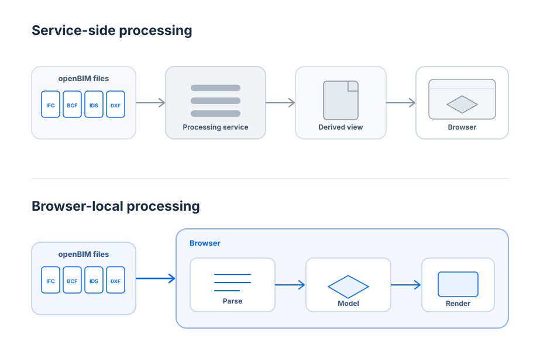

Embedding a BIM viewer into a web application is not only a rendering decision. It establishes a system boundary.

The choice affects where source models are processed, which credentials participate in the request path, whether intermediate representations are created, how model revisions propagate, and which components an engineering team must integrate and operate.

For IFC-centric applications, one question is especially useful:

**Where should IFC model processing live?**

Autodesk Platform Services (APS) and the Flinker IFC Viewer SDK represent two different approaches.

Autodesk provides a broad design-data platform. In Autodesk's documented [Simple Viewer tutorial](https://get-started.aps.autodesk.com/tutorials/simple-viewer), Authentication, Data Management, Model Derivative, and Viewer work together to upload, translate, and display design files.

Flinker provides a more focused IFC-first browser SDK. Its current [IFC Viewer SDK documentation](https://docs.flinker.app/docs/ifc-viewer-sdk.html) shows the host application obtaining model bytes and passing a `Uint8Array` to `viewer.add()`. IFC parsing and WebGL rendering then occur in the browser.

**These are different system boundaries, not different answers to exactly the same platform problem.**

The relevant engineering question is therefore not which product is universally better. It is which processing boundary fits the surrounding application.

## 1. Viewing is an architecture decision

A viewer sits at the end of a larger data path.

Before evaluating toolbars, selection APIs, section planes, or UI customization, architects should map that path:

```text
source model
    |
    v
authorization
    |
    v
file retrieval
    |
    v
model processing
    |
    v
browser representation
    |
    v
rendering and interaction
```

The main architectural difference between the two approaches appears in the model-processing stage.

Autodesk documents the [Model Derivative API](https://aps.autodesk.com/developer/documentation) as translating designs into formats such as SVF and SVF2 for metadata extraction and rendering with the Viewer SDK. It can also extract object hierarchies, properties, and geometry from source models.

Flinker's standard IFC path gives the browser the IFC bytes themselves. The [SDK API reference](https://docs.flinker.app/docs/ifc-viewer-sdk-api.html) describes the application passing those bytes to the viewer, with IFC parsing and WebGL rendering performed in the browser.

That distinction affects authentication, data flow, operational responsibilities, revision handling, and client resource requirements.

## 2. Two system boundaries

Autodesk's Simple Viewer tutorial is a useful reference architecture, provided it is treated as a documented example rather than as the only possible APS topology.

The tutorial uses four APS components:

```text
Application
    |
    v
APS Authentication
    |
    v
Data Management
    |
    v
Model Derivative
    |
    v
SVF / SVF2 viewable
    |
    v
Viewer SDK in browser
```

[Autodesk describes the tutorial](https://get-started.aps.autodesk.com/tutorials/simple-viewer) as an application that can upload, translate, and preview 3D designs and 2D drawings. It explicitly identifies Authentication, Data Management, Model Derivative, and Viewer as the platform components used.

Its authentication implementation creates APS access tokens for different purposes. Autodesk recommends keeping a more capable internal token on the server while exposing a token with narrower permissions to client-side viewer logic.

The tutorial's [data and derivative implementation](https://get-started.aps.autodesk.com/tutorials/simple-viewer/data/) also starts Model Derivative jobs and checks conversion status before the resulting viewable is consumed.

Flinker's documented IFC path places a different boundary around the viewer:

```text
Existing storage / application API
    |
    v
IFC bytes
    |
    v
Browser
    |
    +--> IFC parsing
    |
    +--> viewer representation
    |
    +--> WebGL rendering
```

The API accepts raw file contents as a `Uint8Array`. Flinker's documentation states that the standard IFC viewing path processes the model in the browser rather than sending the IFC to a Flinker processing service.

The architectural implication is specific: an application can keep its existing identity, authorization, storage, and file-retrieval architecture while using the SDK for IFC viewing.

That does not mean the application requires no backend or no infrastructure. Those responsibilities remain with the host system.


*Existing systems stay in control while openBIM processing moves browser-side.*

## 3. Source IFC versus derived viewable

The most concrete technical difference is what the browser viewer consumes.

With APS Model Derivative, a source design is processed into a representation intended for downstream viewing and data access. Autodesk documents SVF and SVF2 as output formats used for Viewer rendering and metadata workflows.

For IFC specifically, Autodesk's current [Model Derivative guidance](https://aps.autodesk.com/blog/model-derivative-api-ifc-svf2-translation-method-v4-and-migration-tips) describes IFC conversion method v4 as the latest IFC-to-SVF/SVF2 method and the recommended conversion method. Autodesk also states that v4 no longer relies on Revit or Navisworks technology and produces results closer to the source IFC than previous methods.

A translation layer is not inherently a disadvantage.

It can be useful when a product needs a common processing pipeline across heterogeneous design formats, centralized preprocessing, viewer-oriented representations, metadata extraction, or integration with other design-data services.

Flinker's standard IFC path instead keeps IFC as the representation supplied to the browser SDK. The application obtains the file and passes its contents to the viewer directly.

For an IFC-first product, this **avoids introducing a separate IFC derivative lifecycle for the standard viewing path**.

The decision question is therefore:

**Does this application benefit from a separately managed derivative representation, or is the source IFC already the representation around which the application is designed?**

## 4. Ownership of identity, permissions, and data

Many CDEs, project portals, digital-twin systems, and construction applications already own the surrounding security model.

They may already implement enterprise identity, project membership, file-level authorization, object storage, protected APIs, revision metadata, and audit logging.

In such a system, the host application already decides whether a user may retrieve a specific IFC revision.

A browser-local IFC path can preserve that boundary:

```text
User
  |
  v
Application identity + authorization
  |
  v
Existing file API / storage
  |
  v
IFC bytes
  |
  v
Browser viewer
```

Flinker's [architecture and data-protection documentation](https://docs.flinker.app/docs/ifc-viewer-architecture-and-data-protection.html) explicitly describes integration patterns in which the application authenticates the user, checks permissions, obtains the file, and then passes its bytes to the viewer.

When APS services participate in the processing path, APS credentials and scoped access tokens also become part of the service architecture. That is visible in Autodesk's Simple Viewer implementation, which uses server-side application credentials to obtain tokens for Data Management and Model Derivative operations and a narrower token for viewing derivative output.

Neither architecture determines whether an application is secure.

A more useful architecture review asks:

* Where does the authoritative source model live?
* Which systems receive the source file?
* Where does model processing happen?
* Which credentials are required at each boundary?
* Who owns user and project authorization?
* Which services can prevent a model from opening?
* What changes when a new model revision is uploaded?

These questions expose trust boundaries more accurately than describing the choice as simply "cloud versus local."

## 5. What runs in the browser versus the service layer

Both approaches ultimately render an interactive model in the browser. They differ in what happens first.

For the documented Model Derivative path:

```text
Source design
    |
    v
Model Derivative service
    |
    v
Viewer-oriented derivative
    |
    v
Browser Viewer
```

For Flinker's standard IFC path:

```text
Source IFC
    |
    v
Browser
    |
    +--> IFC parsing
    |
    +--> viewer representation
    |
    +--> WebGL rendering
```

This changes where engineering constraints appear.

Browser-local IFC parsing makes client characteristics relevant. Teams should consider model size, peak memory use, parsing behavior, browser limits, CPU availability, lower-end hardware, and device variability.

A derivative architecture performs processing before the browser consumes the viewable. In Autodesk's Simple Viewer example, translation is represented as a job whose result and status are tracked separately.

An application using that type of pipeline therefore needs to reason about derivative availability, synchronization with source revisions, failure handling, and retry behavior.

These are architectural trade-offs. They are not performance results.

## 6. Integration and operational surface

Lines of initialization code are a poor proxy for production integration effort.

A production viewer integration normally has to address loading states, viewer lifecycle, authorization failures, application state, telemetry, error handling, deployment, versioning, regression testing, and interaction with the rest of the product.

The more useful question is:

**Which responsibilities does the chosen architecture add to the system?**

| Concern                | APS derivative workflow                                       | Browser-local IFC workflow                               |
| ---------------------- | ------------------------------------------------------------- | -------------------------------------------------------- |
| Source-model access    | Application or APS data workflow, depending on topology       | Host application                                         |
| Model-processing stage | Model Derivative service                                      | Browser SDK                                              |
| Viewer input           | Derived viewable such as SVF/SVF2                             | IFC bytes                                                |
| Service credentials    | APS credentials and scoped tokens where APS services are used | Host application's own access model for source retrieval |
| Revision handling      | Source revision plus derivative state                         | Host application's source-revision lifecycle             |
| Client work            | Viewer rendering and interaction                              | IFC parsing, rendering, and interaction                  |

The Autodesk entries describe the documented Simple Viewer and Model Derivative architecture, not a mandatory topology for every APS application.

The Flinker entries reflect the documented standard IFC path in which the application passes source bytes to the browser SDK.

This is not a complexity score.

APS exposes a broader service surface because it addresses a broader design-data problem. Autodesk currently [documents APIs](https://aps.autodesk.com/developer/documentation) for capabilities including data management, visualization, automation, data exchange, and file translation.

If an application needs those capabilities, using the wider platform can be an architectural advantage.

Conversely, if identity, storage, permissions, revision handling, and IFC delivery already exist, introducing an additional processing boundary should have a specific purpose.

## 7. IFC-first systems and multi-format systems

Format strategy often determines which architecture deserves evaluation first.

Consider an application in which IFC is the authoritative design-model format. Projects, revisions, permissions, and downstream workflows already reference IFC directly.

The viewer requirement is roughly:

> Retrieve this authorized IFC revision and make it interactive inside the existing product.

A focused IFC Viewer SDK is a natural candidate for that architecture.

Now consider a design-data platform ingesting IFC, Revit, DWG, and other design sources. It needs browser visualization across heterogeneous inputs and may also need centralized design-data processing or other Autodesk services.

That is a different problem.

Autodesk describes APS as providing APIs and SDKs across areas including 3D visualization, automation, data management, and file translation. Its Viewer documentation currently describes browser viewing across a broad set of design formats, while Model Derivative handles design translation for Viewer and metadata workflows.

In such a system, the derivative stage can be an intentional normalization and preprocessing layer rather than incidental overhead.

APS is therefore a natural architecture to evaluate when the application is multi-format or already centered on Autodesk-hosted design data and services.

An IFC-specific browser SDK should not be presented as a replacement for that broader platform role.

## 8. IFC, BCF, and IDS as domain concepts

In some OpenBIM applications, model viewing is only one part of the domain model.

IFC represents model geometry and structured building information. BCF carries coordination topics and model-view context. IDS represents machine-readable information requirements that can be evaluated against IFC data.

For the Flinker SDK, it is important to keep the claim narrower than generic "standards support."

The current [SDK documentation](https://docs.flinker.app/docs/ifc-viewer-sdk.html) specifically describes:

* loading BCF files with associated IFC models;
* opening a BCF topic and restoring its saved viewpoint;
* using selected elements from a viewpoint in application UI;
* creating a BCF topic from the current viewer state;
* displaying IDS validation context next to the model;
* visually reviewing failed or relevant elements associated with validation results.

Flinker also provides a [documented BCF example](https://docs.flinker.app/docs/ifc-viewer-sdk-example-bcf-topics.html) that loads an IFC model and an existing `.bcf` file and demonstrates creating a topic with a viewpoint through the runtime exposed by the SDK.

For an application built around these concepts, the domain model may look like:

```text
Project
  |
  +--> IFC revisions
  |
  +--> BCF coordination topics
  |
  +--> IDS requirements / validation context
```

The architectural question is whether the viewer can participate naturally in these existing domain objects.

This should be evaluated through concrete APIs and required workflows, not through a checklist of standard names.

The same rule applies when evaluating APS. BCF or IDS requirements should be mapped against the application's own architecture and Autodesk's current APIs rather than assuming complete support or complete absence.

## 9. Performance trade-offs without benchmarking

Architecture alone does not establish a performance winner.

Browser-local IFC processing introduces client-side parsing work and makes CPU, memory, browser behavior, and device variability relevant.

Derivative-based viewing adds preprocessing before the browser consumes the viewable. Teams need to account for derivative job latency, artifact availability, synchronization, and failure handling.

Neither fact proves which approach produces a better user experience.

Meaningful conclusions require representative production models and controlled measurements.

A useful evaluation should measure at least:

* time until useful interaction;
* total model-open time;
* peak browser memory;
* interaction responsiveness;
* repeated loading;
* large-model behavior;
* federated-model behavior.

For a derivative architecture, preprocessing time and behavior after source revisions should also be measured separately from browser loading.

Without equivalent models, hardware, browsers, network conditions, and measurement criteria, stronger performance conclusions would be speculation.

## 10. Three concrete architecture scenarios

### Scenario 1: Existing IFC-based CDE

Assume a CDE already uses Microsoft Entra ID, project-level authorization, object storage, backend APIs, revision metadata, and IFC as its primary exchange format.

When a user selects a revision, the application already knows who the user is, what project they can access, which revision they requested, and where that IFC is stored.

If the remaining requirement is to inspect the IFC inside the existing application, browser-local processing is a direct architecture to evaluate. It allows the established application boundary to continue governing identity and file access while the SDK handles IFC processing and viewing.

APS could still be appropriate if the CDE also needs APS capabilities. The decision turns on whether the additional design-data and derivative services address requirements beyond the viewer itself.

### Scenario 2: Multi-format design-data platform

Assume a product ingests IFC, RVT, DWG, and other design files and needs a common browser-consumption layer.

It may also rely on Autodesk-hosted project data, centralized metadata extraction, automation, or other APS APIs.

Here, heterogeneous design-data processing is a first-class system requirement.

Model Derivative directly addresses design translation for Viewer and metadata workflows, while APS provides adjacent data-management, visualization, automation, and exchange APIs.

In this scenario, APS is the more natural architecture to evaluate first.

### Scenario 3: IFC quality, BCF, and IDS application

Assume an application centers on IFC inspection, information requirements, issue coordination, and element-level product logic.

IFC is not merely one input format that happens to be displayed. Its objects and identifiers participate directly in the application's workflow.

Flinker's documentation provides concrete browser workflows for [IFC model loading](https://docs.flinker.app/docs/ifc-viewer-sdk-api.html), [BCF topics and viewpoints](https://docs.flinker.app/docs/ifc-bcf.html), and [IDS validation display](https://docs.flinker.app/docs/ifc-ids.html).

That makes an IFC-first SDK relevant to this architecture.

The architectural question is not whether it is a better general-purpose design platform. It is whether keeping IFC and related coordination or validation context close to the application's existing domain model results in a cleaner system boundary.

## 11. A decision framework

Instead of scoring viewer features, start with the surrounding system.

| If this describes the application                                                       | Architecture to evaluate first |
| --------------------------------------------------------------------------------------- | ------------------------------ |
| IFC is the canonical model representation                                               | IFC-first browser SDK          |
| Identity, permissions, and file delivery already belong to the host application         | IFC-first browser SDK          |
| Avoiding a separate IFC derivative lifecycle for the standard viewing path is important | IFC-first browser SDK          |
| IFC, BCF, and IDS are application-level domain concepts                                 | IFC-first browser SDK          |
| Multiple CAD/BIM formats need a common processing platform                              | APS                            |
| Autodesk-hosted design data is central to the architecture                              | APS                            |
| Model Derivative provides useful translation or preprocessing                           | APS                            |
| Other APS APIs already form part of the product                                         | APS                            |

This matrix is not a product ranking. It identifies which architecture is more directly aligned with a given starting point.


*Choose processing architecture based on formats, workflows, and platform needs.*

Then ask the questions that cut across both choices.

**Data boundary:** Where does the authoritative source live, and which systems receive it?

**Processing boundary:** Should source-model processing happen in a service layer or on the client for this application?

**Identity boundary:** Which platform owns user authorization, and which additional service credentials are required?

**Revision boundary:** What processing is triggered when a new source revision arrives?

**Failure boundary:** Which components must be available before the model can open?

**Domain boundary:** Is IFC one supported input among many, or a first-class application object?

**Measurement boundary:** Which production models, devices, browsers, and network conditions will be used to validate the decision?

These questions normally produce a more useful architecture review than a generic viewer feature matrix.

## 12. What this comparison does not claim

This comparison does not claim that Flinker replaces APS as a design-data platform.

It does not claim that every APS application must follow the Simple Viewer topology, that model translation is undesirable, that APS is architecturally inferior, or that APS cannot participate in OpenBIM systems.

It does not claim that browser-local IFC processing removes the need for application infrastructure, automatically makes data private, or guarantees better performance.

It also does not claim that every possible BCF or IDS workflow is implemented by the Flinker SDK. The claims here are limited to the workflows described in Flinker's current documentation.

No pricing, implementation-time, benchmark, or customer-outcome conclusion should be inferred from these architecture diagrams.

The comparison is intentionally narrower: it examines where IFC processing happens and how that boundary fits into the rest of a software system.

## 13. Conclusion

APS and the Flinker IFC Viewer SDK overlap at the point where users inspect BIM models in a web application, but they approach the preceding data path differently.

Autodesk's documented Viewer and Model Derivative workflow places a service-side translation stage between source design files and the browser viewable. That model fits naturally with APS's broader design-data platform, particularly when applications need multiple source formats, Autodesk-connected data, preprocessing, or additional APS services.

Flinker's documented standard IFC path gives the browser the source IFC bytes and performs IFC parsing and WebGL rendering there. That boundary can fit applications that already own identity, authorization, storage, revisions, and IFC delivery and do not require a separate IFC translation stage for standard viewing.

Neither boundary is universally preferable.

For an engineering team, the useful question remains:

**Where should model processing live in this particular system?**

The answer should follow from the application's existing responsibilities, format strategy, trust boundaries, domain model, and operational requirements.

Then it should be tested with representative production models.

**Architecture can identify what needs to be measured. It cannot replace the measurement.**
