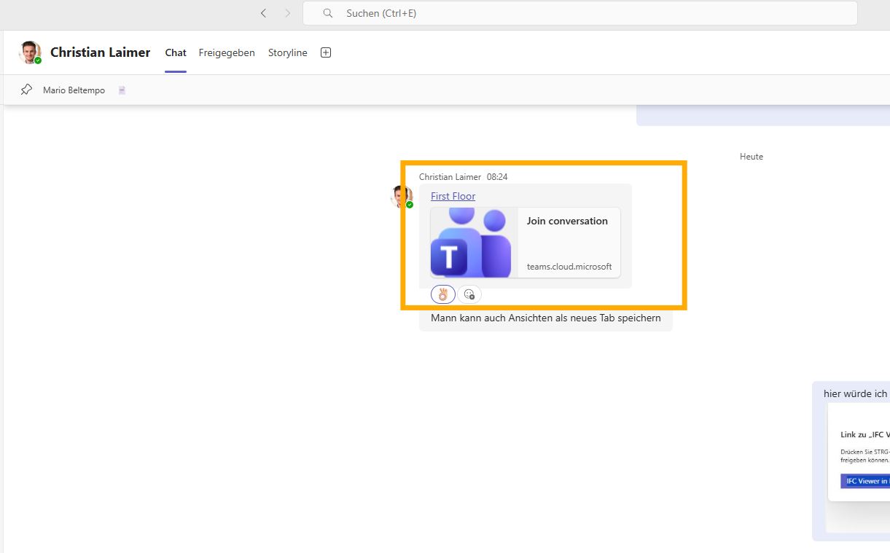

## The Coordination Gap Between Models and Communication

Construction projects generate more structured digital information than any previous generation — and yet coordination failures remain among the industry's most persistent cost drivers. According to an Autodesk and FMI study, 52% of rework is caused by poor project data and miscommunication, accounting for $31.3 billion in excess costs in the US construction market in 2018 alone. Across studies, rework is estimated to represent between 4% and 9% of total project cost, with the higher end reflecting indirect costs such as schedule compression, contractual disputes, and productivity loss on unaffected work packages.

The underlying mechanism is well-documented: information exists in models, but decisions are made in meetings, emails, and chat platforms. The gap between where data lives and where people communicate is where context degrades, references become ambiguous, and corrections happen too late. A structural engineer modifying a beam cross-section in Revit and a general contractor planning a crane lift sequence in Teams are working with representations of the same physical reality, but they are not working in the same information environment.

The Flinker IFC Viewer for Microsoft Teams is designed to close one specific part of this gap: model element access within the communication environment that most construction organizations already operate. It does not replace BIM authoring tools, clash detection platforms, or issue management systems. It makes the IFC model accessible — and linkable — to the full project team, including participants who are not primary BIM users, without requiring them to leave Teams.

> **Generally Available on Microsoft AppSource** — The Flinker IFC Viewer supports IFC 2x3 and IFC 4. It runs as a tab app inside Microsoft Teams, with model data stored and processed within the customer's own Microsoft 365 tenant. [Install from Microsoft AppSource](https://marketplace.microsoft.com/en-us/product/WA200007412?tab=Overview)

---

## What IFC Data Actually Contains — And Why It Matters for Collaboration

Understanding what becomes accessible through an IFC viewer requires a brief examination of the IFC data model itself. Industry Foundation Classes (IFC) is an open international standard published as ISO 16739-1:2024, maintained by buildingSMART International. The current production version is IFC 4.3 (formally IFC4X3_ADD2), though IFC 2x3 — published in 2005 — remains the most widely implemented version across authoring tools, and the Flinker viewer supports both.

Each IFC file encodes three categories of information for every element:

**Identity and semantics**: Every element in an IFC file is assigned a GlobalId — a 128-bit UUID generated at element creation. This identifier is intended to be globally unique and persistent across model revisions, provided the element is not deleted and recreated. The GlobalId is the technical foundation for element-level deep links: a link encodes the file location and the GlobalId, and the viewer uses this to navigate directly to the element and select it. The stability of GlobalIds across model revisions is a known operational constraint discussed further in the limitations section.

**Properties and property sets (Psets)**: IFC elements carry structured property data organized in Psets — named collections of key-value pairs. The IFC 4.3 standard defines approximately 2,500 properties organized across 750+ property sets. In practice, the Psets present on any given element depend on the authoring tool, the project's BIM Execution Plan (BEP), and the export settings used. For an `IfcWall` element, standard Psets include `Pset_WallCommon` (structural function, fire rating, acoustic rating, thermal transmittance) and discipline-specific sets such as `Pset_WallConstruction` or manufacturer-defined property sets. For an `IfcDuctSegment`, coordination-relevant properties such as flow rate, pressure drop, system classification, and installation phase may be present in `Pset_DuctSegmentTypeCommon`. For structural elements like `IfcBeam`, `Pset_BeamCommon` carries load-bearing status, span direction, and roll angle. Whether these properties are actually populated depends on the discipline and the project's information delivery requirements — a topic where ISO 19650 provides normative guidance through the concept of Level of Information Need (LoIN).

**Geometric representation and spatial relationships**: IFC encodes geometry either as boundary representation (B-Rep) for precise solid models or as tessellated geometry for visualization-optimized exports. The IFC Reference View, the primary MVD for viewer-based workflows, uses tessellated geometry. This means that the geometry rendered in the viewer is adequate for coordination and visual inspection but does not carry the parametric intelligence of the native authoring tool. Spatial relationships — which floor a wall belongs to, which building a room is part of, how a duct connects to a fitting — are encoded as explicit relationships in the IFC schema rather than inferred from geometry, which enables accurate property panel navigation even in complex federated models.

This data structure is what makes model-embedded communication qualitatively different from screenshot-based communication. When a BIM coordinator shares a deep link to a structural column, the recipient arrives at an element with a known identity (GlobalId), a known type (`IfcColumn`), and a populated property panel that may include load class, fire resistance, and material specification. The discussion is anchored not to a visual impression but to a structured data object.

---

## How Different Project Roles Use It

### Project Owners and Clients

Project owners occupy a structurally awkward position in BIM workflows: they are the ultimate decision-makers for design and scope changes, but they typically lack the software environment to access the models on which those decisions are based. The standard workaround is mediated access — progress reports, rendered visualizations, PDF plan sets, or screen-sharing sessions during which the design team navigates on the client's behalf. Each mediation step introduces a delay and a simplification.

The current BIM coordination workflow creates a specific problem for owners at milestone review stages. A change request — rerouting a service corridor, modifying a facade panel specification — often cannot be assessed by the owner without first scheduling a session with the design team to establish which elements are affected. This is not a technology gap; it is an access gap. The owner's Microsoft 365 environment, where they manage documents, approvals, and communication, is separate from the BIM environment where the relevant information lives.

With the IFC Viewer in Teams, the model becomes accessible in the owner's existing environment without requiring them to acquire or learn a BIM authoring tool. A design team member shares a deep link to the affected elements in the project channel or in a meeting chat. The owner follows the link, inspects the elements, reviews the properties, and responds in the same thread — without a mediated session, without a screen share, without waiting for the next scheduled review meeting.

For owners overseeing multiple concurrent projects, this changes the information asymmetry of progress oversight. Instead of receiving summarized status reports prepared by the project manager, the owner can verify specific elements against the current model state independently. This is not a replacement for the project manager's coordination role; it is an additional verification channel that reduces dependence on interpreted summaries.

### Architects

Architects author the design model and are responsible for maintaining design intent across all project phases — from schematic design through construction documentation and site supervision. In BIM coordination workflows, they face two recurring problems: communicating *why* an element is specified as it is (a question of intent), and verifying *whether* contractor interpretations of the model match that intent (a question of fidelity).

Both problems involve a communication chain that currently passes through multiple format conversions: Revit or ArchiCAD native model → IFC export → coordination platform or viewer → screenshot or verbal description → decision. Each conversion introduces the possibility of information loss. A facade panel's fire resistance classification might be visible in the Revit model but absent from an IFC export that was configured without `Pset_CoveringCommon`. A structural detail might be correctly specified in the native model but misread from a 2D PDF because the relevant properties were not exported.

The viewer allows architects to share specific elements — with their complete property data as exported — in the Teams environment where contractor questions are typically raised. The element is the reference, not a derivative of the element. If a contractor asks whether a partition wall requires fire stopping, the architect can share the element, which carries its `Pset_WallCommon.IsExternal` and fire-rating properties. The answer is in the model; the viewer makes it accessible without requiring the contractor to operate Revit.

During client review cycles, architects can share model sections directly in Teams — replacing ad hoc screen-sharing sessions for standard design queries. The client sees the same property data the architect is working with, reducing the risk of misaligned expectations about material specifications or spatial relationships.

### Structural and MEP Engineers

Engineering disciplines produce models that must integrate geometrically and semantically with architecture and with each other. The IFC coordination workflow for clash resolution follows a known sequence: federation of disciplinary models → clash detection → issue documentation → design revision → re-federation → verification. BIMcollab, Autodesk Construction Cloud, and similar platforms handle the issue tracking and model quality assurance layers of this workflow.

The specific gap the viewer addresses is in the communication layer between clash detection and design revision. When a clash is flagged between an `IfcBeam` and an `IfcDuctSegment`, the BIM coordinator needs to communicate two things: the identity of the involved elements, and the constraints that govern acceptable resolutions. Currently, this communication typically takes one of two forms — a BCF issue file that encodes the viewpoint and element references, which requires all participants to operate a BCF-compatible tool, or a screenshot with annotations, which encodes the visual state but not the element identity or property data.

A deep link to each involved element provides a third option: a reference that is accessible to any Teams user with model access, carries the full property data of the element, and is permanently associated with the specific model state at the time the link was created (modulo GlobalId stability — see limitations). The structural engineer and the MEP engineer can both follow their respective links, inspect the conflicting elements in context, and discuss the resolution in the same Teams thread — without operating BIMcollab or Navisworks.

MEP engineers benefit specifically from the property inspection capability. For ductwork, fire damper status, flow classification, and system grouping may not be visible from geometry alone but are present in the property panel. For piping, `Pset_PipeSegmentTypeCommon` carries pressure rating, fluid category, and insulation thickness. These are the properties that determine whether a proposed reroute is feasible — and they are available directly in Teams without requiring a round-trip to the authoring tool.

### BIM Coordinators

BIM coordinators are the primary users of dedicated coordination platforms and the most technically sophisticated BIM participants on most projects. For this role, the IFC Viewer in Teams is a complement to existing tools, not a replacement. Its value is in broadening the coordination conversation beyond the subset of participants who operate coordination software.

A coordination round that resolves 15 clashes between structural steel and MEP services requires input from the structural engineer, the MEP contractor, the general contractor's site manager, and the project owner's technical representative — and typically only two or three of these participants use BIMcollab or equivalent software regularly. The coordinator's challenge is extracting relevant decisions from participants who are working in a different tool environment.

The viewer shifts this dynamic: the coordinator can share element links in Teams, and every project participant can follow them with the same visual and data context. The coordination meeting becomes a Teams meeting with model references in the chat, rather than a screen-sharing session where only the coordinator can navigate the model. Issues that require escalation to the owner can be communicated with the specific elements linked, rather than with annotated screenshots that lose property context.

For formal issue tracking, the deep link serves as a persistent element reference. An issue logged in Jira, Planner, or a custom SharePoint list can include the model element link as a field. Anyone following up on the issue weeks later navigates directly to the element, regardless of whether they were present at the original coordination session.

### General Contractors

General contractors span the design-construction boundary and manage coordination across the widest range of project participants. Their BIM use cases range from preconstruction quantity takeoffs and buildability reviews to site logistics planning and subcontractor coordination. In the construction phase, the primary concern is not model authoring but model access — the ability to verify installation details against the design model quickly, at the point of work.

The access problem is most acute for site personnel and subcontractors. A site manager supervising the installation of a curtain wall system needs to verify the fixing specification for a specific panel — but does not operate Revit, does not have a BIMcollab license, and may be working from a tablet on site. The IFC Viewer in Teams addresses this directly: the general contractor's BIM team shares a deep link to the relevant element in the Teams channel used for site communication, and the site manager follows the link, inspects the element, and confirms the specification without leaving Teams.

For subcontractor coordination, the viewer allows the general contractor to share scoped model views — a specific floor's MEP rough-in, a structural bay's connections — in the relevant Teams channel. Subcontractors see the element in context, with the installation-phase properties that determine sequencing. This is not a replacement for a full coordination platform; it is a lightweight access layer that extends model visibility to participants who would otherwise work from 2D drawings or verbal instructions.

### Asset Owners and Property Managers

The value proposition for asset owners and property managers is structurally different from construction-phase use. During construction, model access supports coordination and decision-making. After handover, model access supports facility management — component identification, maintenance planning, and modification assessment.

The practical barrier to post-handover BIM utilization is well-documented: as-built models are delivered in formats that require specialist software to access, and facilities management teams are not typically BIM-trained. The model exists, but it is not operationally accessible. This is a direct consequence of the tool gap between BIM authoring environments and facility management operations.

Because the IFC Viewer runs inside Teams — the environment many FM teams already use for maintenance scheduling, tenant communication, and supplier coordination — it eliminates the tool gap for basic model access. An FM team member who needs to identify the specification of an HVAC unit can open the as-built IFC model in the Teams tab, select the element, and read the manufacturer data, installation date, and maintenance interval from the property panel — without engaging the design team or the BIM author.

For portfolio managers overseeing multiple buildings, the viewer provides consistent model access across assets using the same Microsoft 365 environment. This is particularly relevant for space planning: the IFC spatial structure (`IfcSpace`, `IfcZone`) encodes room boundaries and area calculations that can be used to verify space allocation without a dedicated space management tool.

---

## Deep Links: Technical Mechanism and Operational Constraints

### How Deep Links Work

A deep link in the Flinker IFC Viewer encodes two pieces of information: the SharePoint or Teams file path of the IFC model, and the `GlobalId` of the target element. When the link is followed in Teams, the viewer resolves the file path, loads the model, locates the element by GlobalId, navigates the 3D view to that element, and selects it — opening the property panel automatically.

The link is generated from the viewer toolbar and copied as a URL. It can be pasted anywhere in Teams — chats, channels, meeting chats, or tab descriptions. Any Teams user with access to the model file can follow the link; no additional configuration is required for the recipient.

### GlobalId Stability: The Core Constraint

The operational reliability of deep links depends on the stability of IFC GlobalIds across model revisions. The IFC standard specifies that GlobalIds should be globally unique and persistent, and most BIM authoring tools generate GUIDs at element creation that are preserved across routine modifications such as geometry changes, property updates, and type reassignments. However, GlobalId stability is not guaranteed in several common workflows:

**Element deletion and recreation**: If an element is deleted and a new element is created to replace it — rather than the original element being modified — the replacement element will have a new GlobalId. This is common in major design revisions where elements are fundamentally replaced rather than edited.

**IFC re-export with new ID generation**: Some authoring tool configurations and IFC export plugins regenerate GlobalIds on export rather than preserving the element's internal ID. This results in a file where the same physical element has a different GlobalId in each export, breaking any links created against a previous version.

**Model merge and federation workflows**: When multiple disciplinary models are federated by a BIM coordinator, element GlobalIds from individual files are preserved in the federated model. However, if the coordination platform modifies elements during federation, or if elements are split or merged across model revisions, GlobalId continuity may be lost.

The practical implication is that deep links should be understood as references to a specific element in a specific model version, not as permanent identifiers across the full project lifecycle. Links created during design development may not resolve correctly against a significantly revised model. For construction-phase use and FM use against a stable as-built model, link stability is substantially higher.

This is a known limitation compared to BCF, which encodes not just the element reference but also the viewpoint, camera position, and issue metadata in a standardized format that multiple tools can read. Deep links are simpler and more accessible but less portable and less formally structured than BCF.

### When to Use Deep Links vs. BCF

Deep links and BCF address overlapping but distinct use cases. The decision between them should be based on the required audience and the required formality of the reference.

**Use deep links when**:
- The audience includes non-BIM users who do not operate coordination software
- The reference needs to be embedded in a Teams message, channel post, or task description
- The coordination is informal — a question about a specific element, a status check, a design clarification
- Speed of sharing matters more than structured issue metadata

**Use BCF when**:
- The reference is a formal issue that requires status tracking, assignment, and resolution workflow
- All parties receiving the issue operate BCF-compatible software (BIMcollab, Solibri, Revit)
- The issue metadata — priority, assigned discipline, due date, status — needs to be machine-readable
- Long-term audit trail and issue closure documentation are required

For most construction projects, both mechanisms are useful at different stages. BCF handles the formal coordination loop that BIMcollab and similar platforms manage. Deep links handle the broader project communication that happens around and between formal coordination rounds.

---

## Data Residency and Compliance Architecture

The compliance argument for in-tenant BIM data processing is more specific than the general argument for EU data residency, and it is worth examining carefully — particularly for organizations in Germany operating under the Bundesdatenschutzgesetz (BDSG) alongside GDPR, and for public sector entities subject to additional procurement and data sovereignty requirements.

The relevant legal context is the Schrems II ruling of the European Court of Justice (July 2020), which invalidated the EU-US Privacy Shield framework on the grounds that US surveillance law — specifically FISA 702 and the CLOUD Act — does not provide EU citizens with adequate legal recourse against US government access to their data. The practical consequence for organizations using US cloud services is that data storage within EU datacenters is necessary but not sufficient: the question is whether US parent companies retain theoretical access to data stored in EU infrastructure, which they do under the Cloud Act.

Microsoft's response has been its EU Data Boundary, completed in February 2025, which commits to storing and processing commercial and public sector customer data — including pseudonymized personal data and support case data — within EU and EFTA regions. This addresses the data residency requirement but does not fully resolve the Cloud Act exposure question, which remains subject to ongoing legal analysis.

The Flinker IFC Viewer operates differently from a SaaS platform that processes data on Microsoft's infrastructure. The viewer is a SharePoint Framework (SPFx) application that runs inside the customer's own Microsoft 365 tenant. IFC model files are stored in the customer's SharePoint document libraries — infrastructure the customer's organization already owns and manages within their Microsoft 365 subscription. The viewer processes the IFC geometry and property data within the tenant; no model data is transmitted to Flinker's servers or to any external endpoint.

This architecture means that the data residency and access control applicable to the IFC model are identical to those applicable to any other file in the customer's SharePoint environment — governed by the customer's Microsoft 365 data residency settings, their tenant's access control policies, and Microsoft's EU Data Boundary commitments. There is no additional data processor in the chain beyond Microsoft itself.

For German enterprise clients and public sector entities evaluating BIM collaboration tools, this distinction is operationally significant. A SaaS BIM platform — regardless of where its servers are located — introduces an additional data controller or processor relationship that requires a Data Processing Agreement (DPA), a transfer impact assessment, and ongoing compliance monitoring. The SPFx in-tenant architecture eliminates this relationship for the IFC model data: the data never leaves the customer's own tenant boundary.

This does not mean the viewer is exempt from GDPR compliance requirements — any processing of personal data associated with model use (user activity logs, element access metadata) remains subject to the tenant's GDPR obligations. It means that the model geometry and property data are governed by the same legal framework as the rest of the organization's Microsoft 365 data, without additional compliance complexity.

---

## Positioning Relative to Dedicated BIM Collaboration Platforms

Platforms such as BIMcollab, Autodesk Construction Cloud, and Trimble Connect provide comprehensive environments for model management, clash detection, issue tracking, and information delivery. They are the appropriate primary tools for BIM coordinators managing the formal coordination loop on complex projects. The IFC Viewer for Teams does not replicate these capabilities and is not designed to.

The specific gap the viewer addresses is participation breadth. Coordination platforms are optimized for BIM professionals operating within a dedicated software environment. Project stakeholders outside that environment — clients, FM teams, site personnel, subcontractors, management — either receive mediated access (someone navigates on their behalf) or no access at all. On a project team of 50 people, perhaps 5 to 10 regularly operate coordination software. The other 40 communicate in Teams.

The viewer extends model access to those 40 participants at the access level appropriate for their role: visual navigation, element inspection, and element-level linking. It does not give them clash detection or BCF issue management, because those capabilities serve a different purpose and require a different level of training and context. What it gives them is the ability to follow a model reference, understand what is being discussed, and respond with relevant information — in the environment where they already work.

This is not a substitution argument. Projects that use BIMcollab for formal coordination should continue to do so. The viewer adds a layer beneath that: the informal communication layer where most day-to-day project decisions are actually made.

---

## Getting Started

The IFC Viewer for Microsoft Teams is available on Microsoft AppSource. Installation is performed by a SharePoint administrator. A free plan is available for teams that need viewer access without additional features.

[Install from Microsoft AppSource](https://marketplace.microsoft.com/en-us/product/WA200007412?tab=Overview)

For organizations evaluating the viewer as part of a broader Microsoft 365-based project information environment — including SharePoint CDE, Power BI reporting, and ISO 19650-aligned document management — a guided pilot is available. [Contact Flinker to discuss your project setup.](https://flinker.app/contact)

---

## Related

- [Share Any IFC Model Element Directly in Microsoft Teams](/blog/ifc-viewer-teams-deep-links) — Feature overview of element-level deep links
- [IFC Viewer for SharePoint](/products/ifc-viewer-sharepoint) — The SharePoint-native version of the viewer, for document libraries and Power BI integration
- [ISO 19650 CDE for SharePoint](/products/cde-sharepoint) — Common Data Environment based on SharePoint, aligned with ISO 19650 naming and workflow requirements
