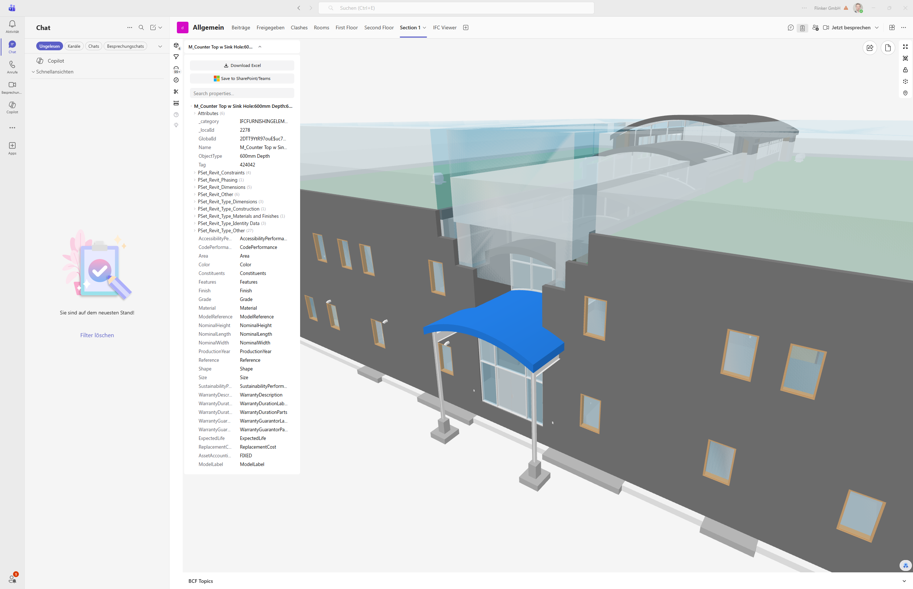

## Stop Describing Elements. Start Linking to Them.

BIM coordination depends on precision. A screenshot tells your colleague roughly where to look. A deep link takes them there — directly inside Teams, with the element already selected and its properties visible.

The Flinker IFC Viewer for Microsoft Teams now supports **element-level deep links**. Select any IFC element, copy the link, and paste it into any Teams chat or channel. The recipient clicks it, the viewer opens inside Teams, and they land on the exact element — no context switching, no ambiguity.

> **Generally Available** — Generate and share deep links to any IFC model element directly within Microsoft Teams. Works in chats, channels, and group messages. No additional license or admin configuration required.

---

## How It Works

**Receiving a deep link**

1. Click the link — shared in a Teams chat, channel, or group message
2. The viewer opens inside Teams automatically
3. The referenced element is highlighted and its property panel opens immediately

**Creating a deep link**

1. Open the IFC model in Teams and select the element you want to reference
2. Click the Share button in the viewer toolbar
3. Press Ctrl+C to copy the URL, then paste it anywhere in Teams

---

## Key Benefits

**Unambiguous element references**
Every deep link points to a single IFC element by GlobalId — not a description, not a screenshot, not a page number. The reference is permanent and exact.

**Stays within Microsoft Teams**
The viewer opens directly inside Teams. No browser redirect, no separate application, no additional login required for the recipient.

**Works across all Teams surfaces**
Paste the link in a 1:1 chat, a project channel, a group message, or a meeting chat. Any Teams user with model access can follow it.

**Full property context on arrival**
When the recipient lands on the element, the complete IFC property panel is immediately visible — including all Psets, attributes, and type data.

---

## Who Uses This

**BIM coordinators and engineers** share links to clash-critical elements directly in coordination meeting chats — eliminating the need to export BCF files or describe element locations verbally.

**General contractors** reference specific structural or MEP elements in issue threads, keeping RFI discussions tied to the exact model component in question.

**Architects and designers** communicate design decisions by linking to the affected element rather than attaching annotated screenshots.

**Project owners and client representatives** receive model links during review cycles and can open them in Teams without installing any additional software.

---

## Get Started

The IFC Viewer for Microsoft Teams is available on Microsoft AppSource. A free plan is included.

[Install from Microsoft AppSource](https://marketplace.microsoft.com/en-us/product/WA200007412?tab=Overview)

Deep links are available now — no update or admin action required. Open any IFC file in Teams, select an element, and click the share icon in the viewer toolbar.

---

## Related

- [IFC Viewer for Microsoft Teams: Model Collaboration Without Leaving Your Project Environment](/blog/ifc-viewer-microsoft-teams-bim-collaboration) — How every project role benefits from BIM access inside Teams
- [IFC Viewer for SharePoint](/products/ifc-viewer-sharepoint) — The SharePoint-native version of the viewer, for document libraries and Power BI integration
