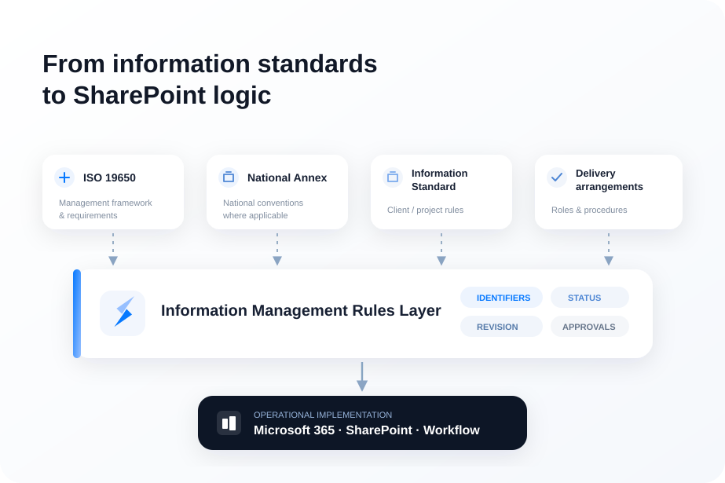
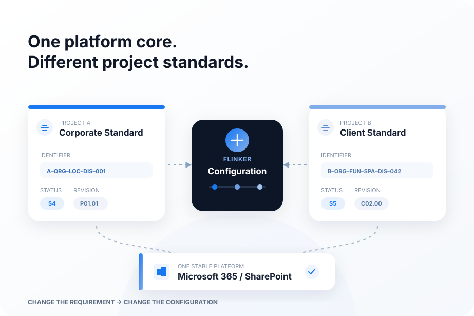

# ISO 19650 in SharePoint: Why Naming, Status and Revision Need to Be Configurable

Implementing ISO 19650 in SharePoint is sometimes reduced to a familiar set of technical tasks: create a naming convention, add status and revision metadata, configure document libraries and automate approvals.

That approach can work for a single, stable information standard. It becomes more difficult when the same organisation delivers projects for clients with different information requirements, conventions and approval processes.

The underlying question is therefore not simply:

**How do we make SharePoint ISO-compliant?**

A more useful question is:

**How do we translate changing information standards into consistent SharePoint behaviour?**

Answering it requires some precision about what ISO 19650 actually standardises, what the UK National Annex adds, what must still be established for a project, and how concepts such as information-container identification, status and revision relate to a common data environment (CDE).

Only then does the SharePoint architecture become clear.

## 1. What ISO 19650-2 actually standardises

[ISO 19650-2:2018](https://www.iso.org/standard/68080.html) specifies requirements for information management during the delivery phase of assets. Importantly, ISO describes these requirements as a **management process** concerned with the production and exchange of information. The standard is intended to apply across asset types, organisation sizes and procurement strategies.

This is broader than a naming standard or document-control specification.

ISO 19650-1 establishes concepts and principles; ISO 19650-2 applies the information-management process to the delivery phase. Within that process, information requirements are established, appointments are made, information is planned and produced, information models are reviewed, authorised and accepted, and information is managed through a CDE.

In the UK, **BS EN ISO 19650-2** adopts the international standard and includes a **UK National Annex**. The National Annex provides UK-specific provisions in areas where national conventions are appropriate, including information-container identification, status codes and a revision system.

There is then another layer that is easily misunderstood: the **information standard** established by the appointing party.

The [UK BIM Framework Guidance E: Tendering and Appointments, Edition 2](https://www.ukbimframework.org/wp-content/uploads/2021/02/Guidance-Part-E_Tendering-and-appointments_Edition-2.pdf) explains its purpose particularly clearly: the information standard establishes the standards against which information is to be produced and subsequently maintained, and it is established by the appointing party. The guidance also recommends incorporating it into appointments where information is to be managed or produced.

This makes the often-used shorthand

**ISO → National Annex → project standard → software**

useful conceptually, but insufficiently precise terminologically.

A more accurate model is:

<ol class="information-model-flow" aria-label="Information-management hierarchy">
  <li><strong>ISO 19650 requirements and concepts</strong></li>
  <li><strong>Applicable national provisions, where relevant</strong></li>
  <li><strong>Appointing party's information requirements, information standard and information production methods/procedures</strong></li>
  <li><strong>Appointment- and delivery-team arrangements</strong></li>
  <li><strong>Operational implementation within the CDE</strong></li>
</ol>

*Translate standards, client requirements and delivery arrangements into governed, machine-readable rules for Microsoft 365.*

These layers are related, but they are not interchangeable.

The appointing party's information requirements describe information that is required and the conditions surrounding its delivery. The information standard establishes standards governing how information is produced and maintained. Information production methods and procedures address the methods by which the delivery team is expected to produce information. These requirements are subsequently reflected in appointments and delivery planning.

This distinction is important for software architecture: **ISO 19650 does not define one universal SharePoint configuration.** It defines an information-management framework within which concrete requirements, standards and methods must be established and implemented.

## 2. Why the 2021 UK National Annex matters

The revision of the UK National Annex in 2021 is a particularly useful case study because it shows how apparently stable information-management conventions can evolve after implementation experience.

The official [UK BIM Framework Guidance Part 2, Edition 6, Section 3](https://www.ukbimframework.org/wp-content/uploads/2021/02/Guidance-Part-2_Parties-teams-and-processes-for-the-delivery-phase-of-assets_Edition-6.pdf) is unusually valuable here because it does more than reproduce the revised approach. Sections 3.1.1–3.1.11 describe individual changes and, in many cases, explain their justification and expected impact.

### Information-container identification became less prescriptive

The 2021 revision changed several aspects of the UK information-container identification convention. Among other things, the revised guidance addresses the applicability of the identifier, field/string lengths and the meaning of individual fields.

One important change was the removal of recommended field-length restrictions.

The 2018 National Annex had inherited restrictions associated with the earlier BS 1192 approach. The [2021 Guidance, Section 3.1.8](https://www.ukbimframework.org/wp-content/uploads/2021/02/Guidance-Part-2_Parties-teams-and-processes-for-the-delivery-phase-of-assets_Edition-6.pdf), for example, explains that restricting the former Role field to one or two characters had not produced substantive standardisation. The restriction was therefore removed, giving the appointing party greater flexibility in determining field length.

That is not simply a formatting change. It changes where a decision is made: less is embedded in a generic national convention, while more can be determined according to the requirements of the appointment or project.

### Role became Discipline

A more fundamental change concerned the former **Role** field.

The 2018 National Annex and BS 1192 approach could mix several different concepts: contractual status, professional occupation and technical discipline. The official 2021 guidance gives a useful example: similar work could be coded differently depending on whether an organisation was viewed as a subcontractor, specialist designer or mechanical engineer.

The revised National Annex therefore changed the purpose of the field from **Role** to **Discipline**. As [Guidance Part 2, Section 3.1.8](https://www.ukbimframework.org/wp-content/uploads/2021/02/Guidance-Part-2_Parties-teams-and-processes-for-the-delivery-phase-of-assets_Edition-6.pdf) explains, the intention was to distinguish the discipline associated with the information from the organisation that produced it, which is already represented by the Originator identifier.

The change is conceptually important. A metadata field is not merely a position in a filename. It has semantics. If those semantics are unclear, apparently valid identifiers can represent inconsistent information.

### Shared status codes were realigned with the ISO 19650 process

Status changed significantly as well.

The [UK BIM Framework Guidance Part 2, Section 3.1.10](https://www.ukbimframework.org/wp-content/uploads/2021/02/Guidance-Part-2_Parties-teams-and-processes-for-the-delivery-phase-of-assets_Edition-6.pdf) records three important changes to Shared status:

* the former **S6 and S7** codes were removed;
* **S5** was introduced;
* S1–S4 were more explicitly aligned with activities in ISO 19650-2.

This is worth examining because S5 illustrates how dangerous it is to treat code values as permanent software constants.

Under the earlier National Annex, S5 had been withdrawn; S6 and S7 were associated with authorisation activities. The 2021 revision removed S6 and S7 and introduced a new S5 aligned specifically with the appointing party's **review and acceptance** activity in ISO 19650-2 clause 5.7.3.

At the same time, S1, S2 and S3 were aligned with the information-model review activity in clause 5.6.5, while S4 was aligned with submission for lead appointed party authorisation in clause 5.7.1.

The Guidance explains the rationale: explicitly relating the status codes to ISO 19650-2 activities was intended to reduce uncertainty over which code should be used at which stage.

Published status was also revised and clarified, including removal of the previous **CR** code and clarification of the A-series approach.

These changes reveal something important about standardisation. Standardisation does not necessarily mean preserving a code forever. It can also mean refining the semantics of the code when implementation experience shows that the earlier model creates ambiguity.

From this, an architectural conclusion can be drawn. This is **not a normative requirement of ISO 19650**, but a software-design inference:

**Standards and their national implementations evolve. Information-management software should therefore treat their operational rules as governed requirements rather than unnecessarily embedding them as immutable software constants.**

That conclusion is particularly relevant because the standards themselves continue to evolve. The current [ISO 19650-2:2018](https://www.iso.org/standard/68080.html) was confirmed in 2024 and remains current at the time of writing. However, [ISO/DIS 19650-2, Edition 2](https://www.iso.org/standard/89704.html) is under development in 2026 and is intended to replace ISO 19650-2:2018 and ISO 19650-3:2020. Its final content may still change while the standard remains under development.

## 3. Information-container identification: structure is not configuration

Before considering SharePoint naming, it is necessary to understand what is being identified.

ISO 19650 uses the concept of an **information container** as a persistent set of information retrievable from a file, system or application storage hierarchy. In practice, information containers can include models, drawings, documents, schedules and other identifiable sets of information; the concept is deliberately broader than "file".

The CDE therefore needs to manage information containers as controlled information objects, not simply as filenames.

In the UK implementation, the 2021 National Annex provides an information-container identification convention. The changes and individual identifiers are documented in [UK BIM Framework Guidance Part 2, Sections 3.1.3–3.1.9](https://www.ukbimframework.org/wp-content/uploads/2021/02/Guidance-Part-2_Parties-teams-and-processes-for-the-delivery-phase-of-assets_Edition-6.pdf).

The revised identifiers are:

**Project – Originator – Functional Breakdown – Spatial Breakdown – Form – Discipline – Number**

This structure comes from the **UK National Annex implementation**, not from ISO 19650 as a universal international naming syntax. That distinction is essential.

The structure identifies the categories of information needed to form an identifier. It does not, by itself, define every value that can appear within those categories.

This gives us two different questions.

**Structure:** Which fields constitute the identifier?

**Configuration:** Which values are permitted in those fields for this appointment or project?

The second question is operationally much more demanding.

A functioning information-management system may need to know which Originator codes have been assigned, which Functional and Spatial Breakdown values are valid, which Form and Discipline values apply, whether project-specific codes have been agreed, how unique numbers are generated, and how the validity of an identifier is checked.

It may also need governance beyond simple code lists:

* who owns each controlled list;
* who may add or retire values;
* when a change becomes effective;
* whether historical values remain valid for existing information;
* whether one value constrains another;
* whether fields are mandatory under the applicable convention;
* how project-specific extensions are documented;
* how invalid combinations are prevented.

The [UK BIM Framework Guidance Part C](https://ukbimframework.org/wp-content/uploads/2020/09/Guidance-Part-C_Facilitating-the-common-data-environment-workflow-and-technical-solutions_Edition-1.pdf) reinforces the broader point that metadata has to be managed through CDE solutions and, where multiple CDE solutions are involved, transferred reliably between them.

The distinction for SharePoint is therefore fundamental:

**Generating a formatted identifier is relatively straightforward. Governing the information rules from which that identifier is generated is the more difficult problem.**

A naming implementation that merely concatenates seven SharePoint columns may reproduce the visible syntax while leaving the underlying governance unresolved.

## 4. Status: from CDE state to suitability code

Status requires an equally careful distinction between **information-container state** and **status metadata**.

The CDE concept described in ISO 19650-1 and elaborated in the [UK BIM Framework Guidance Part C, Sections 2 and 6](https://ukbimframework.org/wp-content/uploads/2020/09/Guidance-Part-C_Facilitating-the-common-data-environment-workflow-and-technical-solutions_Edition-1.pdf) distinguishes information states within the CDE workflow, including **Work in Progress (WIP), Shared, Published and Archive**.

These states describe where information sits within the managed information process.

Broadly, WIP information is being developed within its originating task team. Shared information has been made available for appropriate collaborative purposes. Published information has passed the relevant authorisation and acceptance processes for its intended use. Archive preserves a record of information-container transactions and development.

A **status code** is metadata associated with an information container. It communicates the suitability or permitted use of that information within the applicable convention.

In the revised 2021 UK National Annex, the Shared codes are aligned more explicitly with activities in ISO 19650-2:

| Code | Purpose in the 2021 UK approach       | Process relationship                   |
| ---- | ------------------------------------- | -------------------------------------- |
| S1   | Suitable for coordination             | Information-model review               |
| S2   | Suitable for information              | Information-model review               |
| S3   | Suitable for review and comment       | Information-model review               |
| S4   | Suitable for review and authorisation | Lead appointed party authorisation     |
| S5   | Suitable for review and acceptance    | Appointing party review and acceptance |

The authoritative discussion of the change is in [UK BIM Framework Guidance Part 2, Section 3.1.10](https://www.ukbimframework.org/wp-content/uploads/2021/02/Guidance-Part-2_Parties-teams-and-processes-for-the-delivery-phase-of-assets_Edition-6.pdf).

The distinction between **code** and **process** is crucial.

S4 does not itself perform authorisation. S5 does not itself constitute acceptance. The codes communicate suitability in relation to information-management activities whose responsibilities and procedures are governed elsewhere in the process and appointment arrangements.

Consequently:

**Status ≠ SharePoint choice field.**

A choice field can store a code. It cannot, by itself, establish whether the conditions for that code have been satisfied.

A system model may therefore represent status as something closer to:

**code + meaning + permitted transitions + responsible authority + required action + recorded outcome**

The first two elements derive from the applicable information standard and conventions. The latter elements are an **architectural representation proposed here** for operationalising the associated process; they should not be misrepresented as a data schema prescribed verbatim by ISO 19650.

The important principle is simpler:

**Status should be the consequence of a controlled process, not a substitute for that process.**

## 5. Revision: an information-management concept, not a save counter

Revision requires a similar separation.

The [UK BIM Framework Guidance Part C, Section 5](https://ukbimframework.org/wp-content/uploads/2020/09/Guidance-Part-C_Facilitating-the-common-data-environment-workflow-and-technical-solutions_Edition-1.pdf) explains revision control through metadata assignment. It notes that ISO 19650-1 recommends that the information-container revision system follow an agreed standard, while the UK National Annex provides a specific revision system.

The UK National Annex revision model described in Guidance Part C uses revision metadata with three components. The example **P01.01** illustrates the logic:

* **P** identifies preliminary, non-contractual information;
* the primary numerical component identifies the revision intended to be shared;
* the decimal component identifies WIP development of that primary revision.

The guidance distinguishes this from **C** revisions used for contractual information.

This is significant because revision is connected to information-management state and purpose. It is not simply a count of how many times a digital object has changed.

Compare this with [SharePoint version history](https://learn.microsoft.com/en-us/sharepoint/version-overview). Microsoft describes version history as functionality for viewing or restoring previous versions and tracking when a file or item changed and who changed it.

That is a technical content-management capability. It is useful, but it has different semantics.

An engineer may save or modify a model repeatedly while it remains within the same WIP revision. SharePoint may record several technical versions during that period. None of those technical versions necessarily constitutes a new formal revision under the project's information-management convention.

The distinction can therefore be expressed as follows:

**SharePoint version history** records technical changes to an item or file.

**Revision metadata** identifies the revision/version of an information container according to the agreed information-management convention.

**Information-management workflow** governs the processes through which information is reviewed, shared, authorised, accepted or published and therefore influences when revision metadata should change.

The practical consequence is important: a formal engineering revision should not be generated merely because somebody saved a file.

## 6. Which layer actually defines what?

The distinctions above can be summarised in a matrix. It deliberately separates international requirements, the UK implementation and guidance, appointment/project-specific decisions, and system implementation.

| Concept                                  | ISO 19650                                                                                                                             | UK National Annex / UK Guidance                                                                                                                                                        | Appointment/project definition                                                                                                                   | System implementation                                                          |
| ---------------------------------------- | ------------------------------------------------------------------------------------------------------------------------------------- | -------------------------------------------------------------------------------------------------------------------------------------------------------------------------------------- | ------------------------------------------------------------------------------------------------------------------------------------------------ | ------------------------------------------------------------------------------ |
| **Information-container identification** | Establishes the information-management and CDE context in which information containers require controlled identification and metadata | UK National Annex provides the UK-specific identification convention; 2021 Guidance explains Project, Originator, Functional Breakdown, Spatial Breakdown, Form, Discipline and Number | Applies and, where permitted, extends or configures identifiers and codes to suit the appointment/project                                        | Stores fields, validates values and constructs or manages identifiers          |
| **Codes / controlled values**            | Requires agreed information-management arrangements rather than one universal international code list                                 | National Annex provides UK conventions and example/standard codes in defined areas                                                                                                     | Appointing party's information standard and agreed delivery arrangements determine applicable project-specific values and extensions             | Controlled lists, dependencies, validation and governance mechanisms           |
| **CDE states**                           | ISO 19650-1 establishes the CDE workflow concept and information states                                                               | UK Guidance explains practical application of WIP, Shared, Published and Archive                                                                                                       | Procedures establish how these states are operated in the particular delivery environment                                                        | Permissions, state handling, audit trail and workflow behaviour                |
| **Status**                               | ISO process includes review, authorisation and acceptance activities                                                                  | UK National Annex supplies UK status codes; 2021 revision aligns S1–S5 more explicitly with ISO 19650-2 activities                                                                     | Information standard can define project-specific expansion and application where required                                                        | Metadata plus controlled transition logic and associated process behaviour     |
| **Revision**                             | ISO 19650-1 calls for an agreed revision approach                                                                                     | UK National Annex provides a UK revision system; Guidance Part C explains its application across WIP, Shared and Published information                                                 | Project information standard may define project-specific expansion of the revision system                                                        | Revision metadata and logic, kept distinct from technical file version history |
| **Review / authorisation / acceptance**  | ISO 19650-2 defines these as activities within the delivery-phase information-management process                                      | UK status conventions are aligned to those activities                                                                                                                                  | Appointments, information standard, methods/procedures and delivery arrangements establish applicable responsibilities and implementation detail | Workflow, authority checks, permissions and recorded outcomes                  |

One detail in the UK guidance is especially relevant to this article. The [Guidance Part C checklist](https://ukbimframework.org/wp-content/uploads/2020/09/Guidance-Part-C_Facilitating-the-common-data-environment-workflow-and-technical-solutions_Edition-1.pdf) explicitly asks whether any **project-specific expansion of the standard status codes and revision system** has been defined in the project's information standard by the appointing party, referencing ISO 19650-2 clause 5.1.4.

That is strong evidence against treating the UK codes as a complete, immutable software configuration.

## 7. One platform, two information standards: a hypothetical example

Consider two hypothetical projects delivered by the same engineering organisation.

### Project A — Corporate approach

The appointing party's requirements permit the organisation's established approach:

* Naming convention A
* centrally governed code lists
* Status model A
* Revision convention A
* Review and approval process A

### Project B — Client-defined approach

The client requires:

* different identification codes or project-specific extensions;
* additional mandatory metadata;
* different application of status;
* a different agreed revision convention;
* additional review or approval steps.

Both projects use the same Microsoft 365 environment and SharePoint technology.

**The platform has not changed. The information-management rules have.**

*Support different project and client standards on the Microsoft environment your organization already controls*

In a hard-coded implementation, Project B may require changes to SharePoint columns, validation logic, workflow definitions or application code. If those changes are copied into a project-specific implementation, the organisation gradually accumulates multiple technical variants of what was intended to be one standard solution.

A configuration-driven implementation approaches the problem differently.

The software supports a defined set of information-management rule types, while each project selects or establishes the governed configuration applicable to its appointments.

For example, one configuration might specify:

* identifier fields and their sequence;
* controlled code lists;
* mandatory metadata;
* validation dependencies;
* status codes and permitted transitions;
* revision rules;
* approval requirements;
* roles and authority;
* publication conditions.

This does **not** imply that configuration can accommodate every future requirement. A genuinely new requirement may introduce a rule type or process that the platform does not yet support and therefore require software development.

The architectural objective is narrower and more defensible:

**Where project variation belongs to a known information-management rule type, changing the requirement should ideally require a governed configuration change rather than a new implementation.**

## 8. An Information Management Rules Layer

This leads to an architectural concept that is useful for SharePoint implementations but is **not terminology defined by ISO 19650**: an **Information Management Rules Layer**.

Its purpose is to separate the semantics of the applicable information-management arrangements from the Microsoft 365 mechanisms used to enforce them.

Conceptually:

<ol class="information-model-flow information-model-flow--detailed" aria-label="From information standards to Microsoft 365 implementation">
  <li>
    <strong>ISO 19650 / applicable standards</strong>
    Management framework and requirements
  </li>
  <li>
    <strong>Appointing-party and project information requirements, standards and agreed methods</strong>
    Concrete conventions and rules
  </li>
  <li>
    <strong>Information Management Rules Layer</strong>
    Machine-readable operational representation
  </li>
  <li>
    <strong>Microsoft 365 / SharePoint</strong>
    Metadata, validation, permissions, workflow, versioning and user interaction
  </li>
</ol>

*Naming, status and revision should behave as configurable information-management rules — not fixed software constants.*

The rules layer might represent:

* identifier structure;
* controlled code lists;
* metadata requirements;
* dependencies and validation;
* status semantics and transitions;
* revision rules;
* review and approval requirements;
* roles and authority;
* publication conditions.

The word **machine-readable** is important. A project information standard written only as a PDF remains a document that humans must interpret. Operationalising it requires translating its provisions into structured rules that software can evaluate consistently.

For example, the information standard might state that only a defined set of Discipline identifiers is permitted. The rules layer would represent those values and their governance. SharePoint would then expose the appropriate values to users and reject invalid metadata.

Similarly, an information standard might define when a particular status may be assigned. The rules layer would represent that transition and its prerequisites. SharePoint or an associated workflow mechanism would execute it.

Microsoft provides the technical mechanisms. [SharePoint](https://learn.microsoft.com/en-us/sharepoint/) provides content, metadata, permissions and versioning capabilities, while Microsoft 365 workflow services can automate review and approval processes.

**Microsoft does not define the project's information-management semantics.**

Those semantics originate in the applicable standards, information requirements, information standard, appointments and agreed delivery arrangements. The software's role is to operationalise them faithfully.

## 9. From hard-coded compliance to configurable information management

The distinction can finally be reduced to two architectural patterns.

### Hard-coded information standard

**Requirement changes → software implementation changes**

A code is changed, a status is added or a client requires a different revision process. Columns, validation functions, workflow definitions or application code must be modified.

This may be entirely appropriate for a small or genuinely unique implementation. It becomes expensive when controlled variation is normal across a portfolio of projects.

### Configuration-driven information management

**Requirement changes → governed configuration changes**, provided that the underlying platform already supports the required type of rule.

The platform remains stable while configurations determine how supported information-management rules behave for a particular project or appointment.

The distinction is subtle but important.

The objective is not to make SharePoint infinitely configurable. Nor is it to predict every future revision of ISO 19650, every National Annex or every client requirement.

It is to identify which aspects of information management are expected to vary—identifier structures, code lists, metadata requirements, status models, revision conventions and approval rules—and avoid embedding those unnecessarily in fixed application logic.

The 2021 revision of the UK National Annex demonstrates why this matters. The meaning of an identifier field changed from Role to Discipline. Recommended field-length restrictions were removed. Shared status codes were reorganised and aligned more explicitly with ISO 19650-2 activities. Published status was revised. These were not changes to SharePoint; they were changes to the rules that an information-management implementation needed to represent.

The standards continue to evolve. As of August 2026, [ISO 19650-2:2018 remains the current published edition](https://www.iso.org/standard/68080.html), while [ISO/DIS 19650-2, Edition 2](https://www.iso.org/standard/89704.html) is under development. ISO currently records the draft at the enquiry stage and states that it is intended to replace ISO 19650-2:2018 and ISO 19650-3:2020. Because it remains a draft, its eventual content should not yet be treated as a normative basis for implementation.

This returns us to the central question.

The difficult problem is not:

**“Can SharePoint implement an ISO 19650 naming convention?”**

It is:

**“Can SharePoint follow our information standard on this project—and the client's different standard on the next—without rebuilding the solution?”**

If every controlled project variation requires new code, the organisation has primarily standardised an implementation.

If governed project variation can be represented as configuration, the organisation has moved closer to standardising the **information-management capability itself**.

That is a more durable interpretation of what ISO 19650 implementation in SharePoint should achieve.


