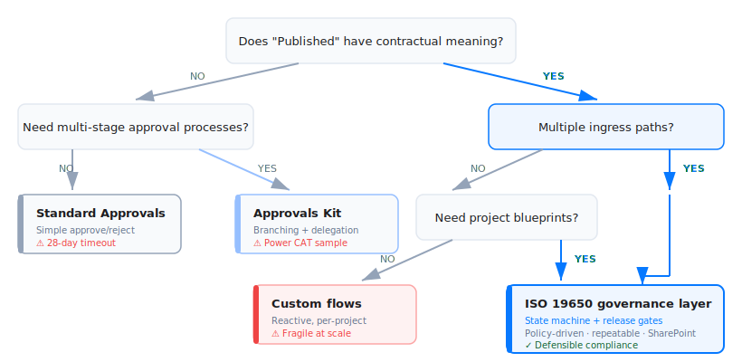

Microsoft Approvals and the Approvals Kit orchestrate decisions (approve/reject). They do not provide ISO 19650 governance primitives: information states, release gates, naming/metadata enforcement, or repeatable project blueprints. A policy-driven ISO layer treats approvals as one step inside a gated state transition—not the governance engine itself.

## The terminology problem

In Microsoft 365 environments, "approval" conflates two distinct concepts: a workflow task (approve/reject an item) and a release authorization (transition information into a contractually binding state). Treating Power Automate approval flows as ISO 19650 publication governance produces fragile implementations, incomplete audit trails, and operational complexity at scale.

## Visual overview

*Three distinct layers: workflow component, process authoring, and governance engine – each with different data planes and support postures.*

## Definitions

### Standard Approvals (connector + Teams app)

The Power Automate [Approvals connector](https://learn.microsoft.com/en-us/connectors/approvals/) exposes actions like "Start and wait for an approval" with documented constraints: guest user limitations, results-field size caps that break "Everyone must approve" scenarios with custom responses, and a 28-day flow timeout.

The Teams Approvals app is a UI layer. The first approval created from Teams [triggers provisioning](https://learn.microsoft.com/en-us/microsoftteams/approval-admin) of the Approval solution in the tenant's default Dataverse environment. All subsequent approvals from Teams are stored there. Template-based approvals split storage: approval metadata goes to Dataverse, form responses go to Microsoft Forms.

### Approvals Kit (Business approvals templates)

The [Approvals Kit](https://learn.microsoft.com/en-us/power-automate/guidance/business-approvals-templates/content) is a Power CAT sample solution—Power Apps, Power Automate flows, and Dataverse tables bundled together—that accelerates multi-stage approval process development. It builds on the standard Approvals connector.

Two constraints matter for enterprise adoption. First, [support](https://learn.microsoft.com/en-us/power-automate/guidance/business-approvals-templates/introduction): Microsoft Support covers the underlying platform but not the kit itself. Second, [environment requirements](https://learn.microsoft.com/en-us/power-automate/guidance/business-approvals-templates/setup): the kit requires a dedicated Dataverse environment. Dataverse for Teams and default environments are not supported.

### ISO 19650 CDE governance

ISO 19650 defines information container states—Work In Progress, Shared, Published, Archive—with explicit progression rules. [UK BIM Framework Guidance C](https://www.ukbimframework.org/wp-content/uploads/2021/02/Guidance-Part-C_Facilitating-the-common-data-environment-workflow-and-technical-solutions_Edition-1.pdf) specifies that "Published" (contractual) information must be authorized by the lead appointed party and accepted by the appointing party.

This distinction matters: ISO governance is a controlled state transition into contractually binding information, not a folder move or workflow task completion.

## Approval workflows vs governance state machines

Approvals solves decision routing: who must approve, what outcomes are valid, timestamps for audit. It's a workflow primitive.

ISO 19650 governance requires more: a state model (WIP → Shared → Published → Archive) with enforced semantics per state, metadata validation (classification, status, revision), release gates that block non-compliant transitions, and traceable records of compliance checks and publication decisions.

[UK Guidance C](https://www.ukbimframework.org/wp-content/uploads/2021/02/Guidance-Part-C_Facilitating-the-common-data-environment-workflow-and-technical-solutions_Edition-1.pdf) frames this explicitly: CDE workflows describe processes for collecting, managing, and disseminating information. The solution is the technology that enforces those processes. Metadata assignment and classification are mandatory, not optional add-ons.

## Why flow-based ISO implementations become fragile

Power Automate-only ISO governance is reactive: file uploaded → check → notify/move/fix. This breaks when enforcement is inconsistent across ingress channels (UI upload, sync client, external tools, APIs), and when logic is distributed across many flows per project. A release gate approach controls promotion to Published, rather than attempting to intercept every upload path.

## Data plane implications

Enterprise governance depends on where records live, who administers them, and how retention works.

### Teams Approvals storage

Teams Approvals [provisions into the default Dataverse environment](https://learn.microsoft.com/en-us/microsoftteams/approval-admin) on first use. All Teams-initiated approvals are stored there. The default environment does not support backups. Retention policies apply to Dataverse tables; Forms data (for template responses) follows its own lifecycle.

### Provisioning controls

In [default environments](https://support.microsoft.com/en-us/topic/power-automate-approvals-provisioning-overview-and-troubleshooting-2306313a-49fa-efde-c716-a34c573ec942), any tenant user can trigger Dataverse provisioning by creating an approval flow. In non-default environments, only environment admins can initiate provisioning. This matters for controlled rollouts.

### Dataverse entity model

Approval records exist as Dataverse entities: [msdyn_flow_approval](https://learn.microsoft.com/en-us/power-apps/developer/data-platform/reference/entities/msdyn_flow_approval) and [msdyn_flow_approvalrequest](https://learn.microsoft.com/en-us/power-apps/developer/data-platform/reference/entities/msdyn_flow_approvalrequest). This affects audit, reporting, exports, and retention strategies.

## The 28-day timeout

Power Automate approval flows [fail after 28 days](https://learn.microsoft.com/en-us/power-automate/approvals-known-issues). The approval record persists in the action center, but the flow instance dies—creating "abandoned approvals" that complete with no downstream effect.

For ISO processes with review cycles exceeding 28 days, the state machine cannot depend on a single "start and wait" flow instance. Decouple the governance state from flow lifecycle.

## Release gate architecture

In ISO-aligned implementations, approval is one check inside the release gate—not the gate itself.

*Release gate sequence: approval is one step inside the gate, not the gate itself. Non-compliant requests are blocked before reaching Published.*

[UK Guidance C](https://www.ukbimframework.org/wp-content/uploads/2021/02/Guidance-Part-C_Facilitating-the-common-data-environment-workflow-and-technical-solutions_Edition-1.pdf) defines Published (contractual) information as authorized by the lead appointed party and accepted by the appointing party. A compliant release gate implements this:

1. User requests state transition to Published
2. System validates naming convention, required metadata, status/revision codes
3. If compliant, trigger approval workflow (when policy requires it)
4. On approval: transition state, record evidence
5. On rejection: block transition, record reason

This makes approval a controlled state transition—not a standalone workflow outcome.

## Capability comparison

✅ = native capability · 🧩 = requires custom build · ⬜ = not provided

| Capability | Flinker ISO 19650 layer | Approvals Kit | Standard Approvals |
|---|:---|:---|:---|
| Approve/reject routing | ✅ | ✅ | ✅ |
| ISO states + semantics (WIP/Shared/Published/Archive) | ✅ | 🧩 | 🧩 |
| Release gate (block promotion unless compliant + approved) | ✅ | 🧩 | 🧩 |
| Naming enforcement (rule-based) | ✅ | ⬜ | ⬜ |
| Metadata compliance tied to state transitions | ✅ | 🧩 | 🧩 |
| Repeatable project blueprint (policy reused across projects) | ✅ | 🧩 | ⬜ |
| Governance audit trail (blocked attempts + reasons + state history) | ✅ | 🧩 | 🧩 |
| Teams UI for approvals | 🧩 | 🧩 | ✅ |
| Business process authoring accelerator | ⬜ | ✅ | ⬜ |
| Primary storage plane | SharePoint | Dataverse | Dataverse (default env) |
| Support posture | Product | Preview / Power CAT sample | First-party |

**Sources:** [Approvals connector](https://learn.microsoft.com/en-us/connectors/approvals/) · [Approvals Kit overview](https://learn.microsoft.com/en-us/power-automate/guidance/business-approvals-templates/introduction) · [UK BIM Framework Guidance C](https://www.ukbimframework.org/wp-content/uploads/2021/02/Guidance-Part-C_Facilitating-the-common-data-environment-workflow-and-technical-solutions_Edition-1.pdf) · [Flinker ISO 19650 app](https://flinker.app/products/iso-19650-app/)

## Flinker's approach

[Flinker's ISO 19650 app](https://flinker.app/products/iso-19650-app/) implements the governance layer on SharePoint: policy JSON defining ISO rules, a release gate enforcing WIP → Shared → Published → Archive transitions, and compliance checks that block non-compliant publications. The [policy-driven architecture](https://flinker.app/blog/iso19650-sharepoint-policy-driven-vs-power-automate/) enables repeatability across projects without per-project flow maintenance.

The layer separation:
- Approvals = decision routing
- Approvals Kit = approval process authoring (Dataverse-centric)
- ISO governance layer = state machine + release gate + policy enforcement

## When to use each

*Decision tree: start with contractual meaning of "Published" – if yes, evaluate ingress paths and blueprint needs to determine the right approach.*

**Standard Approvals** is sufficient when you need generic business approval (no ISO state model), "notify and fix later" is acceptable, and the process is limited to a small number of libraries with a single ingress path.

**Approvals Kit** fits when you need many approval process variants with branching/delegation, want a Dataverse-centric solution, and can accept preview/sample support posture with a dedicated environment.

**ISO governance layer** is required when "Published" has contractual meaning and must be defensible, many projects must roll out consistently (blueprints, controlled variation), and multiple ingress paths exist (sync, APIs, external tools) making reactive flows unreliable.

## Conclusion

Approvals are a workflow primitive. ISO 19650 governance is a state machine with compliance enforcement.

Conflating them mixes three distinct planes: workflow (tasks, outcomes), data (Dataverse default environment, Forms), and governance (states, metadata, release gates, audit evidence).

The robust pattern: governance state machine with release gates, using approvals as one policy-controlled step inside the gate—not as the gate itself.

## References

1. [Standard approvals connector](https://learn.microsoft.com/en-us/connectors/approvals/) — Microsoft Learn
2. [Manage the Approvals app in Microsoft Teams](https://learn.microsoft.com/en-us/microsoftteams/approval-admin) — Microsoft Learn
3. [Known issues and limitations (Approvals)](https://learn.microsoft.com/en-us/power-automate/approvals-known-issues) — Microsoft Learn
4. [Approvals provisioning overview and troubleshooting](https://support.microsoft.com/en-us/topic/power-automate-approvals-provisioning-overview-and-troubleshooting-2306313a-49fa-efde-c716-a34c573ec942) — Microsoft Support
5. [Get started with approvals](https://learn.microsoft.com/en-us/power-automate/get-started-approvals) — Microsoft Learn
6. [Business approvals templates overview](https://learn.microsoft.com/en-us/power-automate/guidance/business-approvals-templates/introduction) — Microsoft Learn
7. [Approvals kit content](https://learn.microsoft.com/en-us/power-automate/guidance/business-approvals-templates/content) — Microsoft Learn
8. [Approvals kit setup](https://learn.microsoft.com/en-us/power-automate/guidance/business-approvals-templates/setup) — Microsoft Learn
9. [ISO 19650 Guidance C: Facilitating the CDE](https://www.ukbimframework.org/wp-content/uploads/2021/02/Guidance-Part-C_Facilitating-the-common-data-environment-workflow-and-technical-solutions_Edition-1.pdf) — UK BIM Framework (PDF)
10. [Flinker ISO 19650 app](https://flinker.app/products/iso-19650-app/) — Flinker
11. [Policy-driven vs Power Automate-only](https://flinker.app/blog/iso19650-sharepoint-policy-driven-vs-power-automate/) — Flinker
