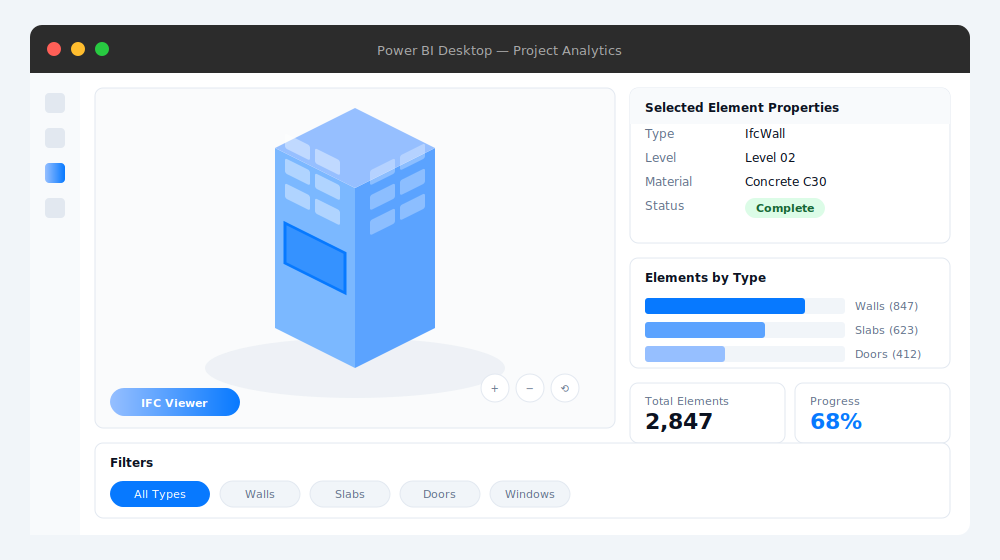

Power BI is the standard for business intelligence across many organizations. But when it comes to construction and facility data, something is missing: the 3D model. IFC files contain rich geometry and attributes, yet Power BI shows only tables and charts—no spatial context.

The Flinker IFC Viewer solves this. It renders IFC models directly inside Power BI reports, enabling interactive 3D visualization alongside your existing dashboards. No external software, no data uploads, no extra licenses.

## What the IFC Viewer does

The IFC Viewer is a Power BI custom visual available on Microsoft AppSource. It enables:

- **Instant 3D visualization**: Paste a link to your IFC file (from SharePoint, OneDrive, or any accessible URL) and the model renders in your report
- **Interactive exploration**: Pan, zoom, and rotate the model using standard controls
- **Element selection**: Click any component to display its properties and metadata
- **Filtering by type**: Isolate walls, beams, doors, MEP equipment, or any IFC element class
- **Data linkage**: Connect model elements to Power BI metrics, KPIs, and charts

*Interactive IFC model rendered inside a Power BI report—3D geometry alongside live data.*

## Key capabilities

### Filtering and selection

Custom filters isolate specific IFC types—walls, slabs, doors, railings, MEP components. Clicking filtered elements highlights them in the 3D viewer, making it easy to navigate complex models.

Hover-over analytics provide instant access to key attributes without leaving the model view.

### Heatmaps and categorization

Create heatmaps and treemaps that categorize elements by type, material, status, or any IFC attribute. Visual encoding makes patterns immediately visible.

### View management with bookmarks

Save favorite views using Power BI bookmarks (personal or report-level). Return to specific model orientations and filter states with one click.

### Automatic data refresh

Configure scheduled or manual refresh to keep dashboards current. Works with cloud sources including SharePoint and OneDrive—model updates automatically reflect in reports.

### External data connections

The real power comes from linking IFC data to external sources:

- **Project schedules**: Connect timelines from scheduling tools to visualize progress against plan
- **Cost data**: Link estimates and actuals for quantity-based analysis
- **IoT sensors**: Add live building performance data for operational dashboards
- **Asset databases**: Integrate CMMS or asset management systems for facility views

## Why not use a standard IFC viewer?

| Capability | Power BI IFC Viewer | Standard IFC Viewer |
|------------|:-------------------:|:-------------------:|
| No extra software or login | ✓ | ✗ |
| Data stays in your storage | ✓ | ✗ |
| Link to external data (cost, schedule, IoT) | ✓ | ✗ |
| Custom charts and KPIs alongside 3D | ✓ | ✗ |
| Microsoft 365 integration | ✓ | ✗ |
| Shareable reports and dashboards | ✓ | ✗ |
| Scheduled data refresh | ✓ | ✗ |

Standard viewers show geometry. The Power BI IFC Viewer connects geometry to your business data.

## Getting started

### 1. Install from AppSource

Download the [IFC Viewer from Microsoft AppSource](https://appsource.microsoft.com/en-us/product/power-bi-visuals/flinkergmbh1644589155747.ifc-viewer) and add it to your Power BI environment.

### 2. Add to your report

Open or create a Power BI report. Select the Flinker IFC Viewer from the Visualizations pane and add it to your canvas.

### 3. Configure the IFC source

In the Format pane, paste a direct URL to your IFC file. Supported sources include SharePoint, OneDrive, Azure Blob Storage, or any publicly accessible URL.

### 4. Explore the model

The viewer renders the 3D model immediately. Use mouse controls to navigate:
- **Left-click + drag**: Rotate
- **Right-click + drag**: Pan
- **Scroll**: Zoom

### 5. Connect to data

Use Power BI's data model to link IFC element IDs to external data sources. Filter the visual based on slicers, or use the model to filter other visuals in your report.

## Use cases

### Construction progress tracking

Link IFC elements to schedule data. Color-code by status (planned, in-progress, complete) to visualize progress spatially. Compare planned vs. actual completion across the model.

### Quantity takeoffs and cost analysis

Extract element quantities from IFC attributes. Connect to cost databases for real-time budget tracking. Analyze cost distribution by building zone, floor, or system.

### Facility management

Visualize building assets within maintenance dashboards. Link equipment to work orders, sensor data, and condition assessments. Support space planning with occupancy overlays.

### Clash detection review

Present coordination status alongside 3D geometry. Highlight elements involved in clashes. Track resolution progress with linked issue data.

### Stakeholder presentations

Share interactive reports with project stakeholders. No BIM software required—anyone with Power BI access can explore the model and data.

## Who uses the IFC Viewer

- **BIM managers and coordinators** handling large-scale IFC models across project phases
- **Construction managers** needing real-time visibility into building component status
- **Facility managers** managing assets with spatial context
- **Project controls teams** linking 3D models to schedule and cost data
- **Architects and engineers** presenting designs with associated metrics
- **Power BI analysts** integrating BIM data into enterprise reporting

## Technical details

### Pricing

The IFC Viewer is **free** for Power BI Desktop. Download from AppSource and start building reports locally. For Power BI Service (cloud publishing), standard Power BI licensing applies.

### Data handling

The viewer fetches IFC files from URLs you provide. No data is uploaded to or stored on Flinker servers. Files remain in your specified location—you maintain full control over data residency.

### Supported formats

The viewer supports IFC2x3 and IFC4 formats. Models exported from Revit, ArchiCAD, Tekla, Navisworks, and other BIM tools are compatible.

### Microsoft 365 integration

- Load IFC files from SharePoint or OneDrive
- Embed reports in Microsoft Teams channels
- Publish to SharePoint sites
- Configure email subscriptions for automated report delivery

## Resources

- [IFC Viewer on AppSource](https://appsource.microsoft.com/en-us/product/power-bi-visuals/flinkergmbh1644589155747.ifc-viewer)
- [Documentation](https://docs.flinker.app/docs/ifc-power-bi.html)
- [Web-based IFC Viewer](https://viewer.flinker.app)


